# S5 and Modular Addition Experiment Log

## Shared S5 Setup

These settings form the common backbone for the main S5 experiments:

- task: `s5`
- teacher checkpoint: `out-s5-cot-len21-depth1-400k`
- main prompt bank used for the later comparisons: `data/s5_clean_prompt_bank_m21_n15000000_val5000`
- main comparison subset size: `8,000,000`
- sequence setting: `m = 21`
- S5 vocabulary size: `8`
- student / BC architecture:
  - `n_layer = 1`
  - `n_head = 8`
  - `n_embd = 512`
  - `dropout = 0.0`
  - `bias = False`
  - `block_size = 294`
- common optimizer / training defaults:
  - `batch_size = 64`
  - `learning_rate = 1e-5`
  - `warmup_iters = 2000`
  - `weight_decay = 0.0`
  - `beta1 = 0.9`
  - `beta2 = 0.95`
  - `grad_clip = 1.0`
  - `dtype = float16`
- later apples-to-apples BC comparisons were standardized on:
  - fixed prompt-bank prefix subsets via `train_order[:N]`
  - `offline_train_shuffle = False`
  - fixed validation split copied from the prompt bank into each rendered dataset

Notes:

- Older helper scripts defaulted to `N_TRAIN=6000000`, but the main later S5 comparison setup was standardized to the `15M` prompt bank and `8M` subset.
- Some older W&B run names do not encode the prompt-bank size, so for early subset sweeps we should verify prompt-bank size from logs or metadata before citing it as fact.
- the newer AICS cluster launchers now use an eta-conditional prefix policy for some resumed / newly launched comparison sweeps:
  - `eta <= 0.2` uses the original `8,000,000` prompt prefix
  - `eta > 0.2` uses `12,000,000`
  - both are prefixes of the same fixed `15M` prompt-bank `train_order`, so the `8M` subset remains a strict ordered subset of the `12M` subset

### Shared S5 Evaluation / Checkpoint-Setting History

This subsection tracks the evaluation-side and checkpoint-side settings that changed across the S5 work. The goal is to keep straight which numbers are historical run provenance versus which numbers are just the current checked-in config defaults.

- historical clean teacher / expert family (`s5_cot`, canonical `out-s5-cot-len21-depth1-400k`):
  - explicitly pinned by the archived summary below:
    - `eval_interval = 5000`
    - `eval_iters = 200`
    - `s5_eval_n = 256`
    - `save_every = 50000`
  - `s5_eval_batch_size` for that historical teacher is not explicitly archived elsewhere in this log; it was likely the trainer default of `256`, but that should be treated as an inference unless re-verified from the raw logs
  - historical logs for that run family included `val/cot_exact`
- historical offline BC families summarized in Sections 2-4:
  - the completed runs summarized there were recorded with:
    - `eval_interval = 5000`
    - `s5_eval_n = 5000`
    - `s5_eval_batch_size = 256`
    - `save_every = 0`
    - `final_eval_on_exit = True`
  - the later checked-in `config/train_s5_clean_offline_bc.py` and `config/train_s5_noisy_bc.py` now differ in a few eval/runtime defaults:
    - `eval_iters = 50`
    - `s5_eval_batch_size = 512`
    - `compile = False`
  - so the old completed-run summaries below should be read as historical run settings, not as a verbatim copy of today’s config files
- historical online OPD / NAIL-OPD comparison runs:
  - the final recorded comparison runs summarized in Section 5 used:
    - `eval_interval = 5000`
    - `eval_n = 5000`
    - `eval_batch_size = 512`
    - `save_interval = 0`
  - some later launcher/status notes mention `eval_batch_size = 1024` for in-progress dev-node or cluster launches, so cite the actual launcher settings for a run family rather than assuming all OPD runs used the same eval batching
- benchmark / backend probes:
  - the short HF end-to-end benchmark used `eval_interval = 100`
  - the larger HF end-to-end benchmark used `eval_interval = 200`
- current trainer-side note:
  - `eval_iters` only affects averaged loss estimates such as `train/loss_eval`, `val/loss`, and `train/clean_oracle_loss_eval` when present
  - exact-match metrics are controlled by `s5_eval_n` and `s5_eval_batch_size`
  - current `train.py` / `train_opd.py` no longer emit `val/cot_exact`; the older S5 sections below still report it because that was the historical logging behavior for the runs being summarized

## 1. Clean Teacher / Expert Checkpoint

Run family:

- trained from the clean S5 CoT task
- config family matches `config/train_s5_cot_len21.py`
- likely same student/teacher architecture listed in Shared S5 Setup

Common run settings:

- dataset: `s5_cot`
- `s5_mode = cot`
- `s5_m = 21`
- `batch_size = 64`
- `learning_rate = 1e-5`
- `max_iters = 400000`
- `eval_interval = 5000`
- `eval_iters = 200`
- `compile = True`
- `s5_eval_n = 256`
- `save_every = 50000`

Historical provenance note:

- the canonical `400k` teacher predates later checked-in config edits, so the numbers in this section should be treated as archival run provenance rather than as a verbatim copy of today’s `config/train_s5_cot_len21.py`

Final metrics:

- `iter = 400000`
- `train/loss = 1.4194e-05`
- `val/loss = 0.00010878`
- `val/cot_exact = 1.0000`
- `val/clean_full_exact = 1.0000`
- `val/clean_final_exact = 1.0000`

Additional downstream diagnostic quality from `s5_noisy_bc_debug_summary.md`:

- native teacher on a `512`-prompt val diagnostic slice:
  - `cot_exact = 0.9921875`
  - `clean_full_exact = 0.9921875`
  - `clean_final_exact = 0.9921875`

Interpretation:

- This checkpoint is the fixed clean teacher used throughout the offline BC and OPD work.
- It is good enough to serve as the canonical expert for the S5 comparisons.

## 2. Clean Offline BC Runs (eta = 0.0)

- TLDR: `n8000000-fixed` is the clean baseline relevant to the later noisy-BC and OPD comparisons. This sweep was only used to find a subset size such that one training pass at `eta = 0.0` gives near-perfect performance, so the smaller-subset bookkeeping is lower priority than the final chosen baseline.

Common run family:

- trainer: `train.py config/train_s5_clean_offline_bc.py`
- sweep wrapper: `scripts/train_clean_offline_sweep.sh`
- dataset generation:
  - rendered from the clean teacher
  - `eta = 0.0`
  - generated by `data/s5_cot/generate_noisy_rollouts.py` with clean rollout behavior
- historical settings for the completed clean offline BC runs summarized here:
  - `batch_size = 64`
  - `learning_rate = 1e-5`
  - `max_iters = 1000000`
  - `warmup_iters = 2000`
  - `dtype = float16`
  - `s5_eval_n = 5000`
  - `s5_eval_batch_size = 256`
  - `offline_single_epoch = True`
  - `compile = True`
  - `final_eval_on_exit = True`
  - later comparison runs use `offline_train_shuffle = False`
- current checked-in `config/train_s5_clean_offline_bc.py` now differs in a few eval/runtime defaults:
  - `eval_iters = 50`
  - `s5_eval_batch_size = 512`
  - `compile = False`

Metric note:

- `train/loss_eval` is not directly comparable across `eta`, because for noisy BC it measures fit to noisy saved targets rather than clean oracle targets
- `train/clean_oracle_loss_eval`, when available, is the more interpretable training-side metric for cross-`eta` comparisons because it evaluates the same prompts against clean oracle CoTs

Subset-sweep structure:

- the standard subset sweep uses `max_iters = 1000000` together with `offline_single_epoch = True`, so completed runs stop after consuming the available dataset rather than after reaching `max_iters`
- the smaller subset sweep through `n6000000` uses `dataset = s5_clean_offline_n6000000`
- the later large-subset runs `n7000000` through `n8500000` use `dataset = s5_clean_offline_n15000000`
- `n6000000-long` is a separate long-run variant on `dataset = s5_clean_offline_n6000000`

Show clean offline BC key results

Key results:

- chosen clean comparison baseline:
  - `n8000000-fixed`
    - `iter_num = 125000`
    - `checkpoint_clean_train_oracle_loss = 0.000158`
    - `checkpoint_clean_full_exact = 0.9952`
    - `val/loss = 1.3823e-04`
    - `val/cot_exact = 0.9952`
    - `val/clean_full_exact = 0.9952`
    - `val/clean_final_exact = 0.9952`
- nearby large-subset reference points:
  - `n7000000`
    - `val/loss = 1.1579e-04`
    - `val/clean_full_exact = 0.9984`
  - `n7200000`
    - `val/loss = 2.3599e-04`
    - `val/clean_full_exact = 0.9948`
  - `n7400000`
    - `val/loss = 3.1818e-04`
    - `val/clean_full_exact = 0.9914`
  - `n7600000`
    - `val/loss = 0.15558`
    - `val/clean_full_exact = 0.0`
  - `n8500000`
    - `val/loss = 9.3695e-05`
    - `val/clean_full_exact = 0.9982`
- long-run reference point:
  - `n6000000-long`
    - `max_iters = 400000`
    - `val/loss = 5.067e-05`
    - `val/clean_full_exact = 0.9964`

Interpretation:

- the practical role of this sweep was baseline selection, not a central scientific comparison
- `n8000000-fixed` was chosen as the clean offline BC baseline used for the later noisy-BC and OPD comparisons
- the smaller subset runs below that threshold are mainly bookkeeping and are not especially important for the main conclusions

## 3. Noisy Offline BC, `greedy_then_corrupt`

Common run family:

- trainer: `train.py config/train_s5_noisy_bc.py`
- sweep wrapper: `scripts/run_noisy_eta_interleaved.sh`
- dataset generation:
  - teacher checkpoint: `out-s5-cot-len21-depth1-400k`
  - prompt bank: `data/s5_clean_prompt_bank_m21_n15000000_val5000`
  - subset size: `8,000,000`
  - rollout mode: `greedy_then_corrupt`
  - `gen_batch_size = 1024` unless overridden to 8192
  - `seed = 1337`
  - render path uses `device=cuda` and `dtype=float16`
  - comparison runs used the same prompt subset across all `eta` values via the fixed `train_order[:8000000]` prefix, with `subset_indices.pt` saved in each dataset
- historical settings for the summarized `greedy_then_corrupt` noisy BC runs:
  - `batch_size = 64`
  - `learning_rate = 1e-5`
  - `max_iters = 1000000`
  - `warmup_iters = 2000`
  - `dtype = float16`
  - `compile = True`
  - `offline_single_epoch = True`
  - `final_eval_on_exit = True`
  - `s5_eval_n = 5000`
  - `s5_eval_batch_size = 256`
  - `save_every = 0`
- current checked-in `config/train_s5_noisy_bc.py` now differs in a few eval/runtime defaults:
  - `eval_iters = 50`
  - `s5_eval_batch_size = 512`
  - `compile = False`

Show greedy_then_corrupt detailed metrics and diagnostics

Final val metrics for the main comparison etas:

- `eta = 0.0`
  - `checkpoint_clean_train_oracle_loss = 0.000158`
  - `checkpoint_clean_full_exact = 0.9952`
- `eta = 0.05`
  - `checkpoint_clean_train_oracle_loss = 0.02441`
  - `checkpoint_clean_full_exact = 0.9956`
- `eta = 0.1`
  - `checkpoint_clean_train_oracle_loss = 0.04925`
  - `checkpoint_clean_full_exact = 0.9980`
- `eta = 0.2`
  - `checkpoint_clean_train_oracle_loss = 0.11062`
  - `checkpoint_clean_full_exact = 0.9322`
- `eta = 0.3`
  - `val/loss = 0.18412`
  - `val/cot_exact = 0.8532`
  - `val/clean_full_exact = 0.8532`
  - `val/clean_final_exact = 0.8554`
- `eta = 0.4`
  - `val/loss = 0.26124`
  - `val/cot_exact = 0.6834`
  - `val/clean_full_exact = 0.6834`
  - `val/clean_final_exact = 0.6908`
- `eta = 0.5`
  - `val/loss = 0.35198`
  - `val/cot_exact = 0.5382`
  - `val/clean_full_exact = 0.5382`
  - `val/clean_final_exact = 0.5488`
- `eta = 0.6`
  - `val/loss = 0.46602`
  - `val/cot_exact = 0.1316`
  - `val/clean_full_exact = 0.1316`
  - `val/clean_final_exact = 0.1568`
- `eta = 0.7`
  - `val/loss = 0.57944`
  - `val/cot_exact = 0.3404`
  - `val/clean_full_exact = 0.3404`
  - `val/clean_final_exact = 0.3594`
- `eta = 0.8`
  - `val/loss = 0.74747`
  - `val/cot_exact = 0.0570`
  - `val/clean_full_exact = 0.0570`
  - `val/clean_final_exact = 0.0812`
- `eta = 0.9`
  - `val/loss = 0.97167`
  - `val/cot_exact = 0.0`
  - `val/clean_full_exact = 0.0`
  - `val/clean_final_exact = 0.0030`

Run metadata:

- for `eta = 0.05` through `0.9`, the `greedy_then_corrupt` noisy offline BC runs all showed:
  - `ckpt_iter = 125000`
  - `completed.txt = iter_num=125000`
  - `max_iters = 1000000`
  - `compile = True`
  - `s5_eval_batch_size = 256`

Dataset-side sanity check diagnostics for some of these etas:

- saved noisy targets vs clean oracle:
  - `eta = 0.05`
    - `rendered_vs_clean_full_exact = 0.013669`
    - `rendered_vs_clean_final_exact = 0.019512`
  - `eta = 0.1`
    - `rendered_vs_clean_full_exact = 0.0001556`
    - `rendered_vs_clean_final_exact = 0.0015045`
  - `eta = 0.2`
    - `rendered_vs_clean_full_exact = 0.0`
    - `rendered_vs_clean_final_exact = 0.0008441`

Main takeaways:

- moderate noise (`0.05`, `0.1`) did not hurt and may have slightly helped clean autoregressive accuracy
- high noise (`0.2`) clearly hurt
- the offline datasets were verified to match the intended prompt bank, subset, teacher checkpoint, and `eta`
- the clean prompt subset was held fixed across etas; only the generated teacher targets changed
- current rerun / provenance note:
  - the metrics recorded above remain the earlier summarized results for this family
  - the higher-`eta` `greedy_then_corrupt` offline BC runs are also being rerun on the dev node because of the same learning-rate issue that affected the other off-policy MC reruns
  - until those reruns finish, the higher-`eta` `greedy_then_corrupt` results should not be treated as the final source of record

## 4. Noisy Offline BC, `sample_then_corrupt`

Common run family:

- trainer: `train.py config/train_s5_noisy_bc.py`
- sweep wrapper: `scripts/run_noisy_eta_interleaved.sh`
- teacher checkpoint default: `out-s5-cot-len21-depth1-400k`
- prompt bank default in the wrapper: `data/s5_clean_prompt_bank_m21_n6000000_val5000`
- main comparison note for these runs used the same `15M` prompt-bank family as the other noisy / OPD comparisons:
  - `data/s5_clean_prompt_bank_m21_n15000000_val5000`
- subset size: `8,000,000`
- dataset generation:
  - `ROLLOUT_MODE=sample_then_corrupt`
  - `GEN_BATCH_SIZE=1024` by default in `scripts/run_noisy_eta_interleaved.sh` unless overridden to 8192
  - `SEED=1337`
  - render path uses `device=cuda` and `dtype=float16`
  - same subset-selection mechanism as the `greedy_then_corrupt` family via the fixed prompt-bank prefix and saved `subset_indices.pt`
- historical settings for the summarized `sample_then_corrupt` noisy BC runs:
  - `batch_size = 64`
  - `learning_rate = 1e-5`
  - `max_iters = 1000000`
  - `warmup_iters = 2000`
  - `dtype = float16`
  - `compile = True`
  - `offline_single_epoch = True`
  - `final_eval_on_exit = True`
  - `s5_eval_n = 5000`
  - `s5_eval_batch_size = 256`
  - `save_every = 0`
- current checked-in `config/train_s5_noisy_bc.py` now differs in a few eval/runtime defaults:
  - `eval_iters = 50`
  - `s5_eval_batch_size = 512`
  - `compile = False`

Implemented matched full-distribution off-policy variant:

- the same sweep surface now also supports an offline full-distribution BC variant for the `distributional_noise` comparison
- render-time setting:
  - `ROLLOUT_MODE=sample_then_corrupt`
  - `TARGET_MODE=teacher_probs`
- train-time setting:
  - `offline_target_type=teacher_probs`
- dataset artifacts for this mode:
  - standard files are still saved:
    - `train_x.pt`
    - `train_y.pt`
    - `val_x.pt`
    - `val_y.pt`
  - plus:
    - `train_teacher_probs.pt`
- the saved supervision for this mode is the full noisy-teacher next-token distribution at each teacher-visited prefix
- current implementation scope:
  - S5 only
  - teacher law fixed to `distributional_noise`
  - trajectory law fixed to `sample_then_corrupt`
- naming prefixes for this family:
  - dataset prefix: `s5_noisy_offline_full_dist_sample_then_corrupt`
  - output prefix: `out-s5-noisy-bc-full-dist-sample-then-corrupt`
  - run prefix: `s5-noisy-bc-full-dist-sample-then-corrupt`
- this gives the direct off-policy full-distribution counterpart to NAIL-OPD (full KL distributional info)
- no completed full-distribution sweep metrics are recorded here yet

Show sample_then_corrupt detailed metrics and diagnostics

Related diagnostics:

- clean teacher sampled rollout sanity check at `eta = 0.0` (`clean_sampled`, no corruption, `5000` val prompts, `10` seeds):
  - `full_exact ≈ 0.98894 ± 0.00107`
  - `final_exact ≈ 0.98902 ± 0.00103`
  - `token_mismatch_rate ≈ 0.00222`
  - interpretation:
    - teacher sampling alone is only mildly worse than clean greedy decoding
    - so the large degradation in sampled noisy-teacher rollouts is driven mainly by corruption, not by sampling by itself

- `s5_noisy_bc_debug_summary.md` confirms that sampled noisy teacher rollouts are also very inaccurate on the clean task:
  - `eta = 0.05`
    - `full_exact ≈ 0.01348`
    - `final_exact ≈ 0.01948`
  - `eta = 0.1`
    - `full_exact ≈ 0.00020`
    - `final_exact ≈ 0.00128`
  - `eta = 0.2`
    - `full_exact = 0.0`
    - `final_exact ≈ 0.00104`

Important distinction:

- the rollout diagnostics above are teacher-rollout diagnostics, not final BC checkpoint metrics
- the actual completed offline BC runs for this family that are currently recorded are `eta = 0.05`, `0.1`, and `0.2`

Confirmed final clean-val metrics:

- `eta = 0.05`
  - `val/loss = 0.02488`
  - `val/cot_exact = 1.0000`
  - `val/clean_full_exact = 1.0000`
  - `val/clean_final_exact = 1.0000`
- `eta = 0.1`
  - `val/loss = 0.04985`
  - `val/cot_exact = 0.9982`
  - `val/clean_full_exact = 0.9982`
  - `val/clean_final_exact = 0.9982`
- `eta = 0.2`
  - `val/loss = 0.10213`
  - `val/cot_exact = 0.9874`
  - `val/clean_full_exact = 0.9874`
  - `val/clean_final_exact = 0.9874`

Run metadata:

- for the completed `eta = 0.05`, `0.1`, and `0.2` runs:
  - `ckpt_iter = 125000`
  - `completed.txt = iter_num=125000`
  - `max_iters = 1000000`
  - `compile = True`
  - `s5_eval_batch_size = 256`
- because the clean sampled teacher remains near-perfect at `eta = 0`, the sampled-teacher ablation is not a fundamentally different experiment due to sampling alone; the main destructive factor is still the corruption law

Current interpretation note:

- these `sample_then_corrupt` offline BC results are much stronger than one might guess from the raw sampled noisy-teacher rollout diagnostics alone
- in particular, they now form the most relevant offline MC baseline for comparison against NAIL-OPD (MC version)
- the matched offline full-distribution BC pipeline for the same `sample_then_corrupt` / `distributional_noise` setting has now been implemented, but it is being intentionally deferred while the MC/simple comparison matrix is filled in first
- current rerun / provenance note:
  - the completed `eta = 0.05`, `0.1`, and `0.2` runs summarized above are still the recorded earlier results for this family
  - the higher-`eta` offline BC MC runs are currently being rerun on the dev node rather than treated as stable AICS results, because the earlier attempt had a learning-rate issue and should not be treated as the final source of record
  - until those reruns finish, do not summarize the higher-`eta` `sample_then_corrupt` offline BC MC results as complete
- TODO: finish these higher-`eta` offline BC MC reruns on the dev node before returning to the offline full-distribution variant.

## 5. Native Online OPD / NAIL-OPD Runs (`train_opd.py`)

Main completed run families:

- NAIL-OPD (MC version)
- NAIL-OPD (full KL distributional info)

Common run family:

- trainer: `train_opd.py`
- sweep wrapper: `scripts/run_opd_sweep.sh`
- task: `s5`
- prompt bank: `data/s5_clean_prompt_bank_m21_n15000000_val5000`
- subset size: `8,000,000`
- teacher checkpoint: `out-s5-cot-len21-depth1-400k`
- teacher law: `distributional_noise`
- student temperature: `1.0`
- optimizer / runtime settings for the final NAIL-OPD runs recorded below:
  - `batch_size = 64`
  - `learning_rate = 1e-5`
  - `warmup_iters = 2000`
  - `dtype = float16`
  - `max_iters = 125000`
  - `compile = False`
  - `eval_batch_size = 512`

Final val metrics:

- NAIL-OPD (full KL distributional info)
  - `eta = 0.05`
    - `val/loss = 0.02676`
    - `val/cot_exact = 0.9996`
    - `val/clean_full_exact = 0.9996`
    - `val/clean_final_exact = 0.9996`
  - `eta = 0.1`
    - `val/loss = 0.05362`
    - `val/cot_exact = 0.9978`
    - `val/clean_full_exact = 0.9978`
    - `val/clean_final_exact = 0.9978`
  - `eta = 0.2`
    - `val/loss = 0.11314`
    - `val/cot_exact = 0.9912`
    - `val/clean_full_exact = 0.9912`
    - `val/clean_final_exact = 0.9920`
  - `eta = 0.3`
    - `val/loss = 0.18354`
    - `val/cot_exact = 0.9874`
    - `val/clean_full_exact = 0.9874`
    - `val/clean_final_exact = 0.9884`
  - `eta = 0.4`
    - `val/loss = 0.26317`
    - `val/cot_exact = 0.9774`
    - `val/clean_full_exact = 0.9774`
    - `val/clean_final_exact = 0.9784`
  - `eta = 0.5`
    - `val/loss = 0.35154`
    - `val/cot_exact = 0.9728`
    - `val/clean_full_exact = 0.9728`
    - `val/clean_final_exact = 0.9738`
  - `eta = 0.6`
    - `val/loss = 0.45356`
    - `val/cot_exact = 0.9696`
    - `val/clean_full_exact = 0.9696`
    - `val/clean_final_exact = 0.9706`
  - `eta = 0.7`
    - `val/loss = 0.57080`
    - `val/cot_exact = 0.9560`
    - `val/clean_full_exact = 0.9560`
    - `val/clean_final_exact = 0.9570`
  - `eta = 0.8`
    - `val/loss = 0.71447`
    - `val/cot_exact = 0.9666`
    - `val/clean_full_exact = 0.9666`
    - `val/clean_final_exact = 0.9684`
  - `eta = 0.9`
    - `val/loss = 0.90635`
    - `val/cot_exact = 0.6366`
    - `val/clean_full_exact = 0.6364`
    - `val/clean_final_exact = 0.6418`

- NAIL-OPD (MC version)
  - `eta = 0.05`
    - `val/loss = 0.02660`
    - `val/cot_exact = 0.9986`
    - `val/clean_full_exact = 0.9986`
    - `val/clean_final_exact = 0.9986`
  - `eta = 0.1`
    - `val/loss = 0.05021`
    - `val/cot_exact = 0.9982`
    - `val/clean_full_exact = 0.9982`
    - `val/clean_final_exact = 0.9982`
  - `eta = 0.2`
    - `val/loss = 0.11239`
    - `val/cot_exact = 0.9278`
    - `val/clean_full_exact = 0.9278`
    - `val/clean_final_exact = 0.9280`
  - `eta = 0.3`
    - `val/loss = 0.17792`
    - `val/cot_exact = 0.8932`
    - `val/clean_full_exact = 0.8932`
    - `val/clean_final_exact = 0.8944`
  - `eta = 0.4`
    - `val/loss = 0.25450`
    - `val/cot_exact = 0.7012`
    - `val/clean_full_exact = 0.7012`
    - `val/clean_final_exact = 0.7090`
  - `eta = 0.5`
    - `val/loss = 0.33869`
    - `val/cot_exact = 0.6938`
    - `val/clean_full_exact = 0.6938`
    - `val/clean_final_exact = 0.7004`
  - `eta = 0.6`
    - `val/loss = 0.45007`
    - `val/cot_exact = 0.6780`
    - `val/clean_full_exact = 0.6780`
    - `val/clean_final_exact = 0.6842`
  - `eta = 0.7`
    - `val/loss = 0.57270`
    - `val/cot_exact = 0.5576`
    - `val/clean_full_exact = 0.5576`
    - `val/clean_final_exact = 0.5750`
  - `eta = 0.8`
    - `val/loss = 0.75663`
    - `val/cot_exact = 0.1120`
    - `val/clean_full_exact = 0.1120`
    - `val/clean_final_exact = 0.1406`
  - `eta = 0.9`
    - `val/loss = 0.99095`
    - `val/cot_exact = 0.0`
    - `val/clean_full_exact = 0.0`
    - `val/clean_final_exact = 0.0032`

Main takeaways:

- all NAIL-OPD runs listed were run for `125000` steps
- NAIL-OPD (full KL distributional info) stays very strong through `eta = 0.8`, while NAIL-OPD (MC version) degrades much earlier
- at high noise, the gap is dramatic:
  - `eta = 0.8`: NAIL-OPD (full KL distributional info) `= 0.9666` vs NAIL-OPD (MC version) `= 0.1120`
  - `eta = 0.9`: NAIL-OPD (full KL distributional info) `= 0.6364` vs NAIL-OPD (MC version) `= 0.0`

Experiment note:

- some NAIL-OPD runs were first launched with `MAX_ITERS = 110000` and later resumed exactly from checkpoint to `125000`
- the metrics recorded above are the final completed `125000`-step values, not the earlier partial snapshots
- duplicate W&B display names exist for some partial or crashed OPD runs, so comparisons should use the completed `125000`-step runs above

### 5.1 OPD (MC version) status

Current native S5 OPD setup for OPD (MC version):

- backend: native nanoGPT OPD path
- launcher: `bash scripts/run_opd_sweep.sh`
- prompt bank: `data/s5_clean_prompt_bank_m21_n15000000_val5000`
- subset size: `8,000,000`
- teacher checkpoint: `out-s5-cot-len21-depth1-400k`
- teacher law: `distributional_noise`
- objective: OPD (MC version)
- planned etas: `0.05 0.1 0.2 0.3 0.4 0.5 0.6 0.7 0.8 0.9`
- `eval_batch_size = 1024` (unless overridden to 512)
- `compile = 0`

Status:

- OPD (MC version) is currently running, so it is not summarized with final results yet
- this sweep uses the same `15M` prompt bank and `8M` subset as the NAIL-OPD / offline BC comparisons
- the native backend is being used because the HF backend benchmarked slower

### 5.2 OPD (full KL distributional info) status and run provenance

Current native S5 OPD setup for OPD (full KL distributional info):

- backend: native nanoGPT OPD path
- launcher: `run_s5_opd_eta.sh` -> `bash scripts/run_opd_sweep.sh`
- prompt bank: `data/s5_clean_prompt_bank_m21_n15000000_val5000`
- subset-size policy on the current cluster launcher:
  - `eta <= 0.2`: `8,000,000`
  - `eta > 0.2`: `12,000,000`
- teacher checkpoint: `out-s5-cot-len21-depth1-400k`
- teacher law: `distributional_noise`
- objective: `reverse_kl_full`
- currently launched high-`eta` sweep on cluster: `0.2 0.3 0.4 0.5 0.6 0.7 0.8 0.9`
- `eval_batch_size = 1024`
- `compile = 0`

Run provenance / execution notes:

- dev node / workstation-side run:
  - a single `eta = 0.1` `reverse_kl_full` run was already active on the dev node (`vs2972@blocklab`) and was later terminated there to free capacity for the cluster sweep
  - the active process that was killed on the dev node was PID `2458315`
- AICS Slurm cluster run:
  - the cluster copy used for the sweep is `/scratch/blocklab/ved/small-cot-experiments`
  - the working account / partition used for the cluster sweep is `blocklab`
  - the cluster sweep is launched as one Slurm job per `eta` rather than as a single chained multi-`eta` job, because each run is comfortably below the `1-00:00:00` per-job cap while the full sweep is not
- early AICS launch attempts failed for operational reasons before reaching stable training:
  - the first batch-script revision used the script spool path rather than `SLURM_SUBMIT_DIR`, which caused `mkdir -p logs/...` to fail under Slurm
  - the first successful Slurm launches also revealed that the cluster copy was missing both:
    - the `15M` clean prompt bank `data/s5_clean_prompt_bank_m21_n15000000_val5000`
    - the teacher checkpoint directory `out-s5-cot-len21-depth1-400k`
  - both assets were then copied from the dev node into the AICS repo copy
- WandB / log provenance note:
  - the first fully data-complete AICS relaunch of the high-`eta` sweep of the `eta = 0.3 ... 0.9` jobs ran before `wandb login` was completed on AICS, so those jobs printed `wandb.init failed` warnings and were canceled
  - then the `eta = 0.2 ... 0.9` sweep was then relaunched on AICS after `wandb login`, so the corresponding `logs/opd/*.log` files may contain both:
    - earlier `wandb.init failed` warnings
    - later successful WandB initialization / run URLs

Status:

- OPD (full KL distributional info) was launched on AICS and is resumable from the rolling `ckpt.pt` checkpoints, but it is now being deliberately deprioritized in favor of finishing the MC/simple comparisons first
- at the time of this status update, the relevant active AICS Slurm jobs were the running `reverse_kl_full` jobs `36010`, `36011`, and `36013`
- the current plan is to stop those running full-distribution jobs only after preserving the latest written `ckpt.pt` state, then return to them later rather than treating them as abandoned
- final metrics are not yet summarized here
- once the sweep finishes, tabulate it directly against:
  - offline BC full-distribution
  - NAIL-OPD (full KL distributional info)
  - OPD (MC version)

### 5.3 Comparison framing, current impressions, and TODOs

Important interpretation note from later discussion:

- the main scientific question is whether on-policy rollouts help relative to off-policy training
- to isolate that effect cleanly, we should change as few variables as possible between the online and offline baselines
- there is a separate axis besides on-policy vs off-policy:
  - MC / sampled supervision:
    - train against realized teacher token targets
  - full-distribution supervision:
    - train against the teacher's full next-token distribution
- NAIL-OPD (full KL distributional info) uses full next-token teacher distributions, while the standard noisy offline BC baseline only uses realized teacher token targets
- so a direct comparison of NAIL-OPD (full KL distributional info) against the current offline BC baseline is not yet a pure on-vs-off-policy comparison; it also changes how much teacher information the student receives

Current impressions for S5 task:

- the online MC estimator, NAIL-OPD (MC version), appears stronger than the offline BC MC baseline on a per-`eta` basis
- in several cases, the online MC method appears competitive with offline BC at the next lower `eta`
- the strongest qualitative full-distribution example so far is that NAIL-OPD (full KL distributional info) at `eta = 0.4` appears to outperform the offline BC MC baseline even at lower `eta` values such as `0.3`, `0.2`, and `0.1`, and the same qualitative pattern appears to hold at other `eta` values as well
- the `sample_then_corrupt` offline BC baseline is itself quite strong at low and moderate `eta`, which makes the online-vs-offline MC comparison more meaningful and worth tabulating carefully
- the matched offline full-distribution BC pipeline has now been implemented for the `distributional_noise` / `sample_then_corrupt` setting, so the remaining missing piece there is the actual sweep and table, not the code path itself
- current execution priority has shifted to MC/simple methods first:
  - finish the offline BC MC and OPD MC sweeps
  - pause both offline BC full-distribution and OPD full-distribution cluster work after a resumable latest checkpoint exists
  - return to the full-distribution comparisons only after the MC matrix is in good shape

These full-distribution comparisons should still be interpreted cautiously until the missing matched baselines below are run and tabulated explicitly.

## 6. What Experiments Are Still Missing

This section tracks the full sweep matrix in one place so it is clear which ablations are already done, which are currently running, and which still need to be launched.

Normalization notes:

- offline BC `sample_then_corrupt` is the matched off-policy MC law for online methods that sample from the `distributional_noise` teacher
- offline BC `greedy_then_corrupt` is the matched off-policy law for online methods using `corrupted_greedy`

Terminology glossary:

- `sample_then_corrupt`:
  offline rollout law; at each step, sample from the clean teacher distribution, then corrupt the sampled digit with probability `eta`, and feed that corrupted token into the next step
- `distributional_noise`:
  online teacher-law name for the full next-token distribution induced by `sample_then_corrupt`; this is the distribution-level counterpart of the same noisy process
- `greedy_then_corrupt`:
  offline rollout law; at each step, take the clean teacher argmax token, then corrupt that greedy digit with probability `eta`, and feed that corrupted token into the next step
- `corrupted_greedy`:
  online teacher-law name for the full next-token distribution induced by `greedy_then_corrupt`; this is the distribution-level counterpart of the greedy-corrupt process
- current matching rule:
  compare NAIL-OPD / OPD runs using `teacher_law=distributional_noise` against offline BC `sample_then_corrupt`, not against offline BC `greedy_then_corrupt`

Teacher-side vs student-side vs eval-side knobs:

- teacher-side knobs:
  - offline BC uses `rollout_mode` plus `target_mode`
  - online OPD / NAIL-OPD uses `teacher_law`
  - these teacher-side choices determine what noisy expert behavior or noisy expert distribution the student is trained against
- student-side knobs:
  - the online objective determines how the student is updated from that teacher signal
  - `reverse_kl_tm` = OPD (MC version)
  - `forward_kl_simple` = NAIL-OPD (MC version)
  - `reverse_kl_full` = OPD (full KL distributional info)
  - `forward_kl_full` = NAIL-OPD (full KL distributional info)
  - `student_temperature` controls the student's own rollout policy during online training:
    - `student_temperature > 0`: sampled student rollouts
    - `student_temperature = 0`: greedy student rollouts
  - the main S5 online runs summarized here use `student_temperature = 1.0`, so their training rollouts are sampled rather than greedy
- eval-side metrics:
  - `val/cot_exact`: teacher-forced exact CoT match
  - `val/clean_full_exact`: greedy autoregressive exact match of the full clean CoT
  - `val/clean_final_exact`: greedy autoregressive exact match of only the final clean answer
  - the main notebook plots currently use `val/clean_full_exact` and `val/clean_final_exact`, so the plotted eval curves are greedy rollout evaluations rather than teacher-forced ones

Shared defaults for the main comparison sweeps:

- `task = s5`
- teacher checkpoint: `out-s5-cot-len21-depth1-400k`
- prompt bank: `data/s5_clean_prompt_bank_m21_n15000000_val5000`
- subset size: `8,000,000`
- `eta` grid: `0.05 0.1 0.2 0.3 0.4 0.5 0.6 0.7 0.8 0.9`
- unless explicitly noted otherwise

Sweep matrix:

| Comparison | Sweep | Matched law | Status | Notes |
|---|---|---|---|---|
| Clean baseline | Clean offline BC, `eta = 0.0`, chosen `n8000000-fixed` baseline | clean teacher | Done | Canonical off-policy clean baseline for all later comparisons |
| Off-policy MC baseline | Offline BC, `sample_then_corrupt`, full `eta` sweep | `sample_then_corrupt` | In Progress | earlier results are recorded; higher-`eta` runs are being rerun on the dev node because of a learning-rate issue in the earlier attempt |
| On-policy MC | NAIL-OPD (MC version), full `eta` sweep | `distributional_noise` | Done | Main on-policy MC family |
| On-policy MC | OPD (MC version), full `eta` sweep | `distributional_noise` | In Progress | This is the current OPD MC sweep that is running |
| Off-policy greedy-corrupt baseline | Offline BC, `greedy_then_corrupt`, full `eta` sweep | `greedy_then_corrupt` | In Progress | earlier results are recorded, but being rerun on the dev node because of the learning-rate mishap |
| On-policy full-distribution | NAIL-OPD (full KL distributional info), full `eta` sweep | `distributional_noise` | Done | Completed online full-distribution family |
| Off-policy full-distribution match | Offline BC trained on full teacher next-token distributions, full `eta` sweep | `distributional_noise` | Deferred | Implemented, but intentionally paused while the MC/simple comparison matrix is prioritized |
| On-policy full-distribution | OPD (full KL distributional info), full `eta` sweep | `distributional_noise` | Deferred | `reverse_kl_full` is implemented and resumable from AICS `ckpt.pt`, but the active cluster focus has shifted back to MC/simple methods |
| On-policy MC greedy-corrupt match | NAIL-OPD (MC version), full `eta` sweep | `corrupted_greedy` | TODO | Direct online match to completed offline `greedy_then_corrupt` BC |
| On-policy MC greedy-corrupt match | OPD (MC version), full `eta` sweep | `corrupted_greedy` | TODO | Needed if the OPD MC family is to be matched to offline `greedy_then_corrupt` as well |
| On-policy full-distribution greedy-corrupt ablation | NAIL-OPD (full KL distributional info), full `eta` sweep | `corrupted_greedy` | TODO | Needed if teacher-law ablations are to be symmetric in the full-information setting |
| Off-policy full-distribution greedy-corrupt match | Offline BC trained on full teacher next-token distributions, full `eta` sweep | `corrupted_greedy` | TODO | Current implementation does not support this teacher-law family yet |
| On-policy full-distribution greedy-corrupt ablation | OPD (full KL distributional info), full `eta` sweep | `corrupted_greedy` | TODO | Full-information OPD teacher-law ablation |

### 6.1 Visualization TODOs

General note:

- prefer plotting from real `eval_history.jsonl` data or full W&B eval-history exports rather than from hand-copied summary values whenever possible
- for resumed runs, stitch histories by `iter` and keep the latest row for duplicate optimizer steps
- the main clean eval curves plotted below use greedy autoregressive metrics (`val/clean_full_exact` and `val/clean_final_exact`), not teacher-forced `val/cot_exact`
- the notebook [notebooks/s5_offline_bc_vs_nail_opd_mc_eval_curves.ipynb](/Users/vedsriraman/columbia/code/small-cot-experiments/nanoGPT/notebooks/s5_offline_bc_vs_nail_opd_mc_eval_curves.ipynb) now exports plot images to `analysis/figures/s5_eval_curves/`; rerun the relevant plot cells to refresh the embedded figures below

Current plotting TODOs:

- TODO: make WandB-style eval-curve plots for the matched offline BC MC vs NAIL-OPD MC comparison in three regimes:
  - low noise: offline BC MC `eta = 0.05, 0.1, 0.2, 0.3`; NAIL-OPD MC `eta = 0.05, 0.1, 0.2, 0.3, 0.4`
  - medium noise: offline BC MC `eta = 0.4, 0.5, 0.6`; NAIL-OPD MC `eta = 0.4, 0.5, 0.6, 0.7`
  - high noise: offline BC MC and NAIL-OPD MC both at `eta = 0.7, 0.8, 0.9`
- TODO: for each of the three regime-specific MC comparison figures above, plot both:
  - `iter` vs `val/clean_full_exact`
  - `iter` vs `val/clean_final_exact`
<!-- - TODO: make the corresponding matched offline BC full-distribution vs NAIL-OPD full-distribution eval-curve figures once the offline full-distribution sweep is run
- TODO: make endpoint summary plots of final clean-task performance vs `eta` for:
  - offline BC MC
  - NAIL-OPD MC
  - offline BC full-distribution
  - NAIL-OPD full-distribution
- TODO: make a delta-vs-`eta` plot for the matched on-policy vs off-policy gap:
  - NAIL-OPD MC minus offline BC MC
  - NAIL-OPD full-distribution minus offline BC full-distribution
- TODO: make an information-ablation plot comparing MC vs full-distribution supervision at matched `eta` separately for:
  - offline methods
  - online methods
- TODO: make full training-curve plots for the main families:
  - clean offline BC baseline
  - offline BC MC `sample_then_corrupt`
  - offline BC MC `greedy_then_corrupt`
  - NAIL-OPD MC
  - NAIL-OPD full-distribution
  - OPD MC
  - OPD full-distribution once available
- TODO: make one compact matrix figure or table-backed heatmap with rows = method families and columns = `eta`, where each cell shows final `clean_full_exact`
- TODO: make one appendix-style diagnostic figure comparing `clean_full_exact` and `clean_final_exact` directly to show where they meaningfully diverge and where they are visually almost identical -->

S5 exported eval-curve figures

Current exported MC eval-curve figures:

Low noise:

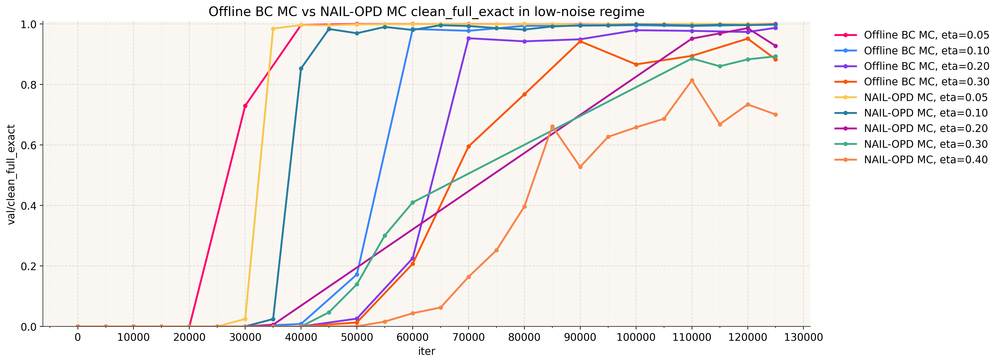

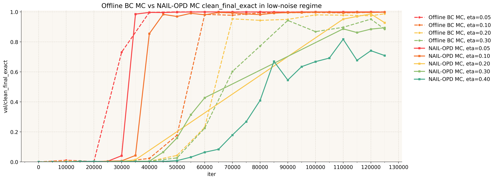

Medium noise:

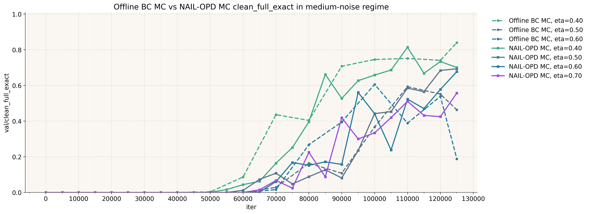

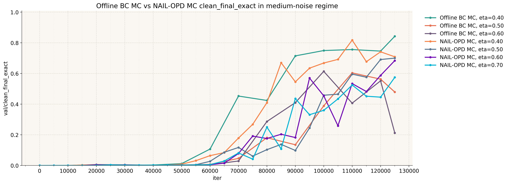

High noise:

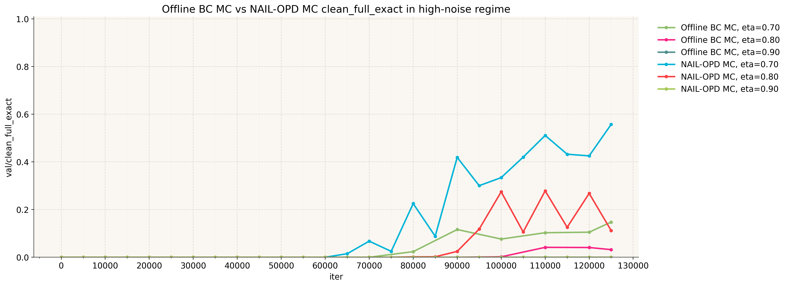

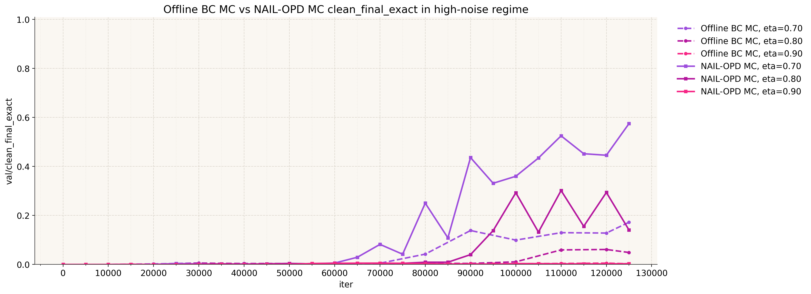

Current exported per-`eta` method-comparison figures:

- these plots use fixed method colors across all noise levels: `Offline BC MC`, `NAIL-OPD MC`, and `OPD MC`
- if a given `OPD MC` curve is not available yet, rerun the notebook after that sweep finishes so the corresponding image file is regenerated

<code>clean_full_exact</code> per-eta figures

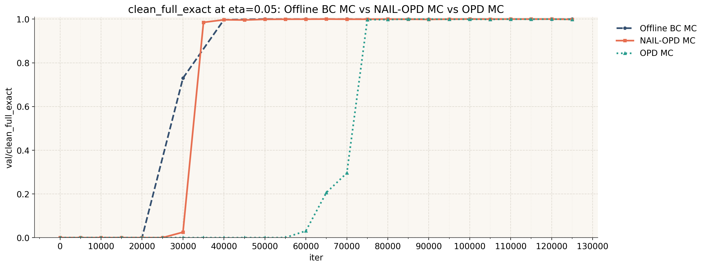

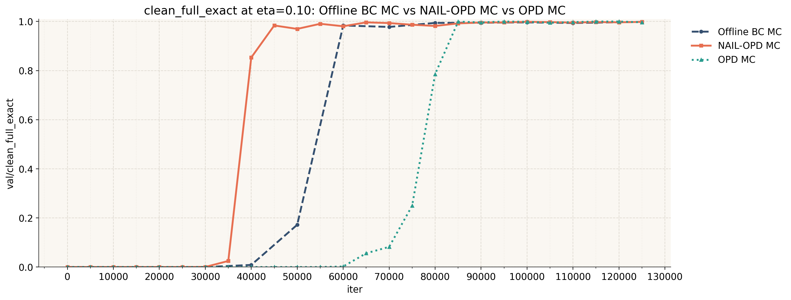

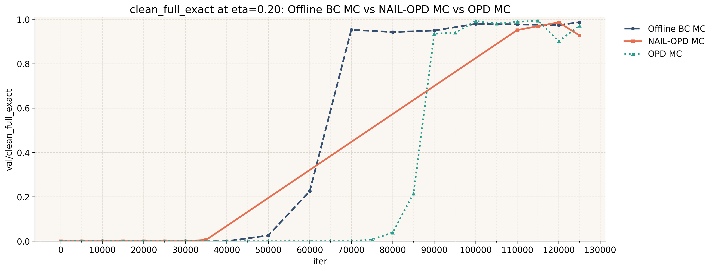

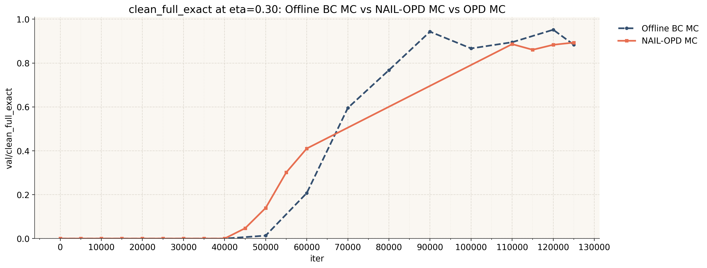

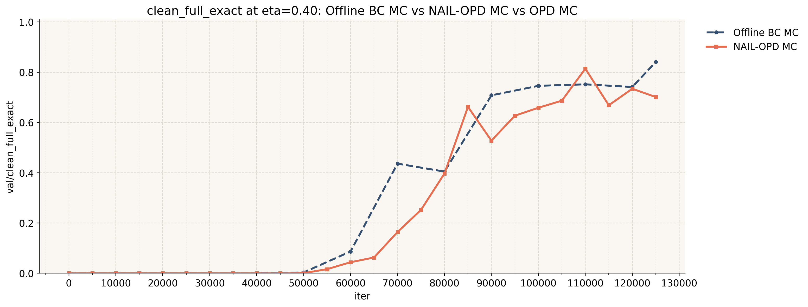

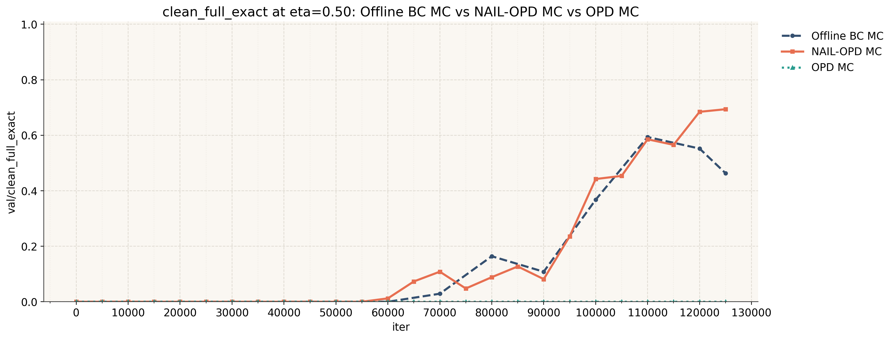

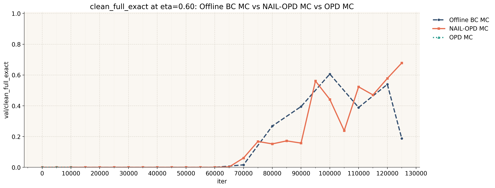

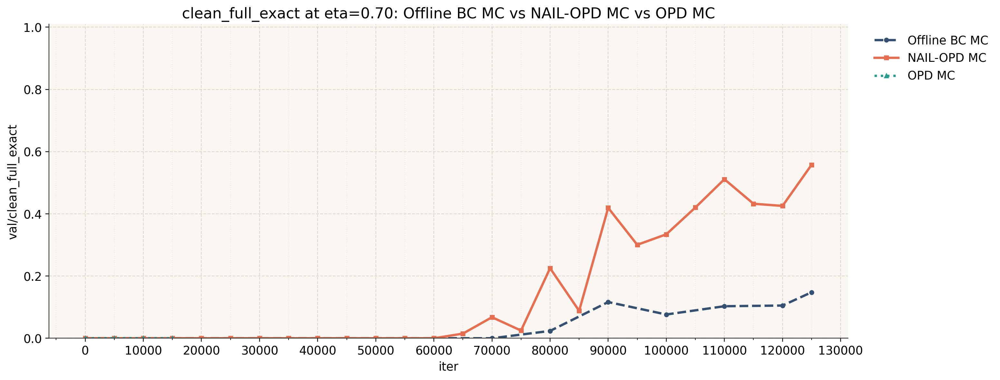

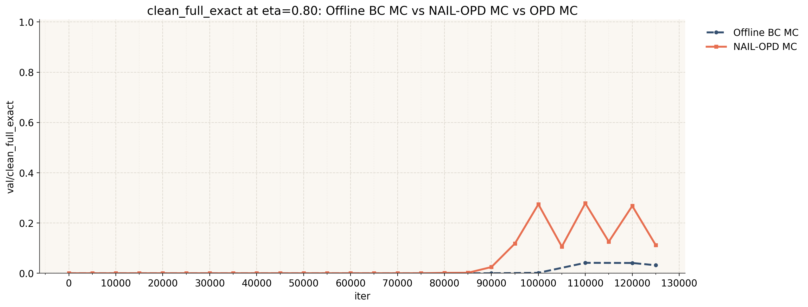

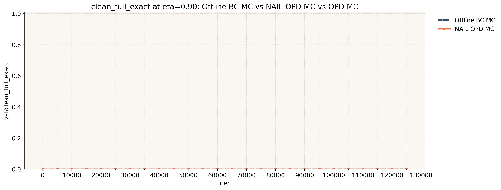

<code>clean_final_exact</code> per-eta figures

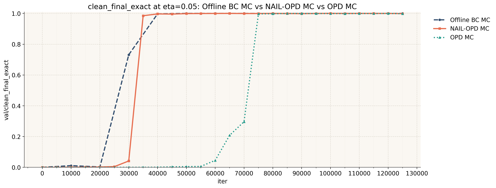

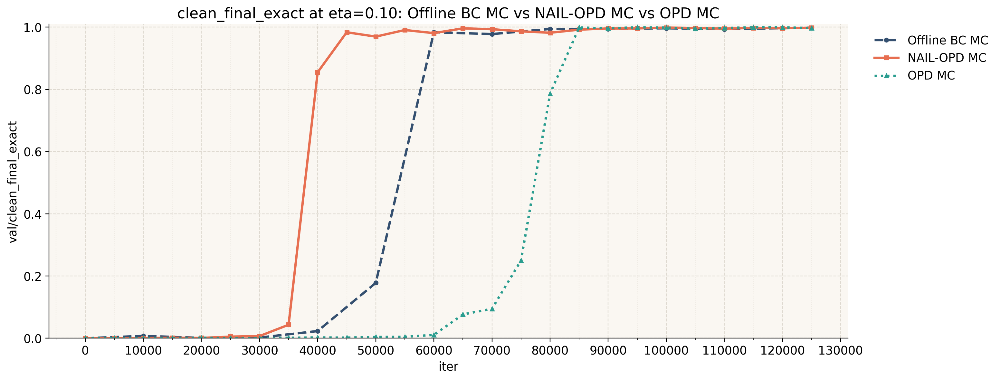

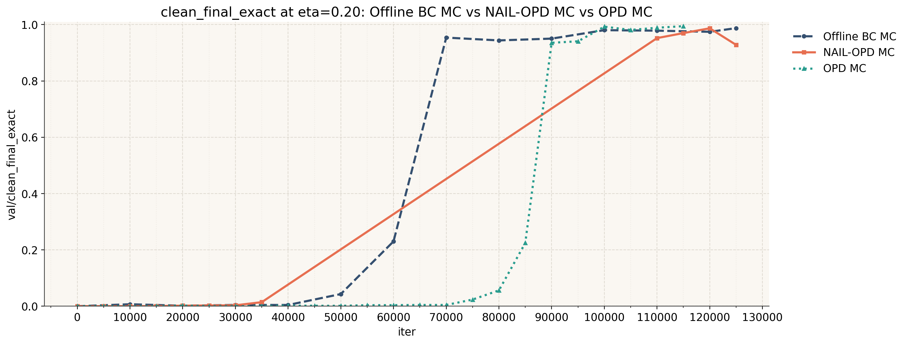

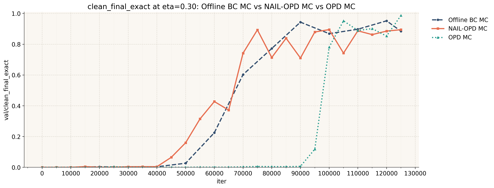

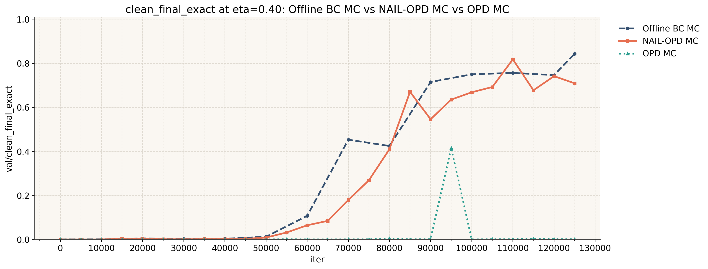

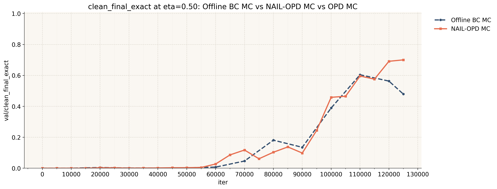

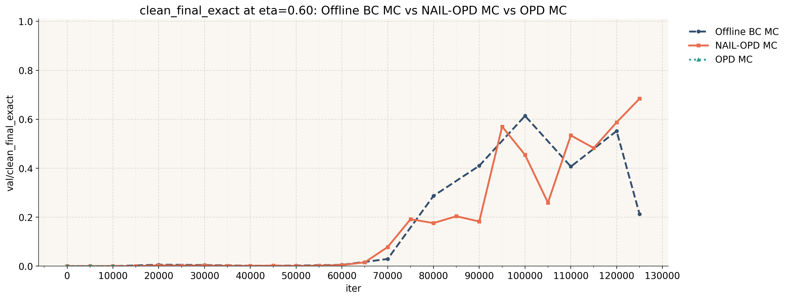

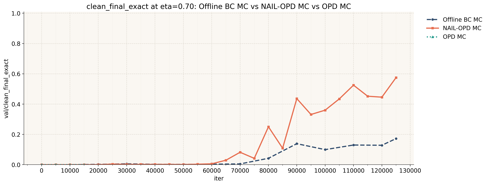

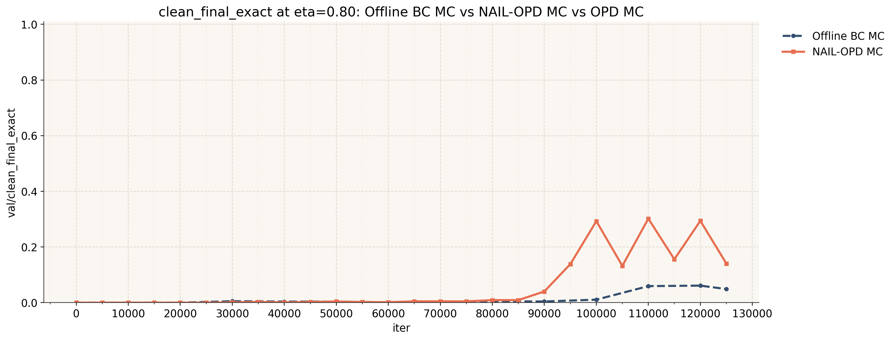

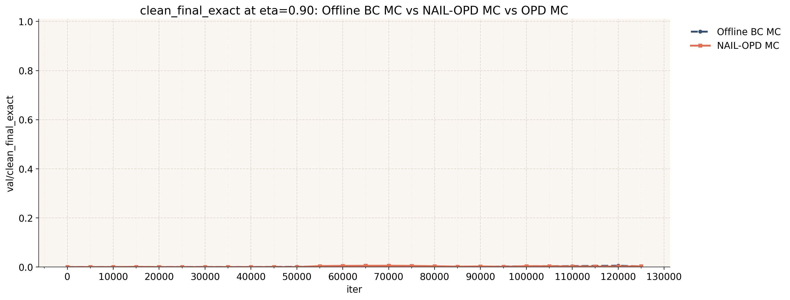

Priority order for the unfinished sweeps:

1. finish the sweeps already running:
   - offline BC `greedy_then_corrupt` higher-`eta` reruns on the dev node
   - offline BC `sample_then_corrupt` higher-`eta` reruns on the dev node
   - OPD (MC version) sweep completion
2. complete the remaining MC/simple online matches:
   - NAIL-OPD (MC version) with `corrupted_greedy`
   - OPD (MC version) with `corrupted_greedy`
3. only after the MC/simple matrix is reasonably complete, return to the deferred full-distribution comparisons:
   - offline BC full-distribution, `distributional_noise`
   - OPD (full KL distributional info) completion on AICS
4. only then do the symmetric full-information greedy-corrupt ablations:
   - NAIL-OPD (full KL distributional info) with `corrupted_greedy`
   - offline BC full-distribution with `corrupted_greedy`
   - OPD (full KL distributional info) with `corrupted_greedy`

 Remarks on HF Backend Development and Benchmarks

- TLDR: We tried HF conversion and --compile for optimization speedups while doing OPD training. Neither showed any benefit over our current implementation (which already uses cached rollouts).

From `s5_opd_hf_backend_summary.md`:

- new trainer: `train_opd_hf.py`
- new helper layer: `data/s5_cot/opd_hf.py`
- new sweep wrapper: `scripts/run_opd_hf_sweep.sh`

### 7.1 Functional validation

Confirmed validations:

- helper unit tests:
  - `python3 -m unittest tests.test_opd_objectives tests.test_opd_hf`
  - result: all `13` tests passed
- training smoke tests:
  - OPD (MC version)
  - NAIL-OPD (MC version)
  - NAIL-OPD (full KL distributional info)
  - HF resume smoke test
  - HF `--compile` smoke test

These were smoke / correctness checks rather than convergence experiments, so no task-level comparison metrics are recorded from this part.

### 7.2 Train-throughput benchmark

Matched settings:

- objective: NAIL-OPD (full KL distributional info)
- teacher checkpoint: `out-s5-cot-len21-depth1-400k`
- prompt bank: `data/s5_clean_prompt_bank_m21_n15000000_val5000`
- subset size: `8,000,000`
- `eta = 0.2`
- teacher law: `distributional_noise`
- batch size: `64`
- evaluation effectively disabled to isolate train-step throughput

Measured steady-state times:

- `nanogpt_full_c0 = 2659.48 ms`
- `nanogpt_full_c1 = 2766.29 ms`
- `hf_full_c0 = 3635.51 ms`
- `hf_full_c1 = 3623.95 ms`

Interpretation:

- HF without compile was about `36.7%` slower than the fastest native baseline
- HF with compile was about `36.3%` slower than the fastest native baseline
- compile did not help here

### 7.3 Short end-to-end benchmark

Matched settings:

- objective: NAIL-OPD (full KL distributional info)
- teacher checkpoint: `out-s5-cot-len21-depth1-400k`
- prompt bank: `data/s5_clean_prompt_bank_m21_n15000000_val5000`
- subset size: `8,000,000`
- `eta = 0.2`
- teacher law: `distributional_noise`
- batch size: `64`
- `max_iters = 220`
- `eval_interval = 100`
- `eval_n = 5000`
- `eval_batch_size = 512`

Measured wall-clock:

- `nanogpt_full_e2e = 45.87 s`
- `hf_full_e2e = 49.27 s`

Interpretation:

- HF was about `7.4%` slower end-to-end in this short benchmark

### 7.4 Larger end-to-end benchmark

Matched settings:

- objective: NAIL-OPD (full KL distributional info)
- teacher checkpoint: `out-s5-cot-len21-depth1-400k`
- prompt bank: `data/s5_clean_prompt_bank_m21_n15000000_val5000`
- subset size: `8,000,000`
- `eta = 0.2`
- teacher law: `distributional_noise`
- batch size: `64`
- `max_iters = 600`
- `eval_interval = 200`
- `eval_n = 5000`
- `eval_batch_size = 512`

Measured wall-clock:

- `nanogpt_full_e2e_v2 = 94.91 s`
- `hf_full_e2e_v2_c0 = 117.95 s`
- `hf_full_e2e_v2_c1 = 122.11 s`

Interpretation:

- HF without compile was about `24.3%` slower than native
- HF with compile was about `28.7%` slower than native

Decision recorded in the summary:

- stay on the native nanoGPT OPD backend for production sweeps
- keep `--compile` off for that path for now

## 8. Modular Addition Task

This section starts the analogous experiment log for the modular-addition task. At the moment it mainly records the checked-in pipeline, sweep structure, and smoke artifacts. There are no completed `out-modadd-*` result directories in this repo copy right now, so this section is intentionally more provenance-heavy than results-heavy.

### 8.1 Shared Modular-Addition Setup

- task: `modadd`
- current default clean-teacher / expert family:
  - `out-modadd-cot-p${P}-m${M}-depth1`
- current default large prompt-bank family used by the checked-in modadd sweep wrappers:
  - `data/modadd_clean_prompt_bank_p${P}_m${M}_n15000000_val5000`
- current checked-in main setting:
  - `p = 7`
  - `m = 21`
- task structure from `data/modular_addition/task.py`:
  - prompt tokens are `m` residues followed by `=`
  - target tokens are the running modular sums after each prompt residue
  - prompt length = `m + 1`
  - CoT length = `m`
  - `final_answer_len = 1`
  - total packed sequence length = `2m + 1`, so `block_size = 2m = 42` at `m = 21`
- vocabulary:
  - size = `p + 1`
  - at the default `p = 7`, vocabulary size is `8` tokens (`0..6` plus `=`)
- student / BC architecture:
  - same hidden architecture as the main S5 comparisons, except with the smaller modular-addition sequence length:
    - `n_layer = 1`
    - `n_head = 8`
    - `n_embd = 512`
    - `dropout = 0.0`
    - `bias = False`
    - `block_size = 42`
- common optimizer/runtime defaults in the checked-in modadd configs:
  - `batch_size = 64`
  - `learning_rate = 1e-5`
  - `warmup_iters = 2000`
  - `weight_decay = 0.0`
  - `beta1 = 0.9`
  - `beta2 = 0.95`
  - `grad_clip = 1.0`
  - `dtype = float16`
  - the LR schedule is now matched to the S5 / native-OPD convention:
    - warm up from `1e-6` to `learning_rate`
    - then stay flat via `decay_lr = True`, `lr_decay_iters = max_iters`, `min_lr = learning_rate`
- common eval/logging defaults in the checked-in modadd configs:
  - `eval_interval = 5000`
  - clean expert:
    - `eval_iters = 50`
    - `s5_eval_n = 256`
    - `s5_eval_batch_size = 512`
  - offline BC:
    - `eval_iters = 50`
    - `s5_eval_n = 5000`
    - `s5_eval_batch_size = 512`
  - online OPD sweep wrapper:
    - `max_iters = 125000`
    - `eval_n = 5000`
    - `eval_batch_size = 512`
  - compile defaults are now off across the checked-in modadd train configs and wrappers:
    - `compile = False` for the `train.py` config files
    - `COMPILE = 0` for the OPD wrapper
  - W&B defaults are on across the checked-in modadd configs / wrappers
  - `save_every = 0`, so `train.py` keeps rewriting the rolling `ckpt.pt` rather than writing numbered intermediate checkpoints
  - current `train.py` / `train_opd.py` no longer log `val/cot_exact`; modadd reporting now centers on:
    - `val/loss`
    - `val/clean_full_exact`
    - `val/clean_final_exact`
    - `train/clean_oracle_loss_eval` when applicable

### 8.2 Checked-In Artifacts / Current Evidence

- checked-in smoke prompt-bank / dataset artifacts:
  - prompt bank:
    - `data/modadd_clean_prompt_bank_p3_m4_n12_val6_smoke`
  - clean offline dataset:
    - `data/modadd_clean_offline_p3_m4_n12_smoke`
  - noisy offline dataset:
    - `data/modadd_noisy_offline_p3_m4_n12_eta_0p1_smoke`
- these smoke artifacts confirm the current metadata layout:
  - prompt-bank metadata stores:
    - `task`
    - `p`, `m`
    - `prompt_len`, `cot_len`, `final_answer_len`
    - `n_train`, `n_val`
    - `seed`
    - `nested_subset_order_saved`
  - offline-dataset metadata stores:
    - `subset_size`
    - `eta`
    - `gen_batch_size`
    - `device`, `dtype`
    - `prompt_bank_dir`
    - `teacher_checkpoint`
    - `train_targets_source`
    - `train_decode_mode`
    - `val_targets_source`
- no completed full `out-modadd-*` training directories are present in this repo copy right now, so the subsections below mostly document intended experiment structure and current provenance rather than final science results

### 8.3 Clean Teacher / Expert Checkpoint

Run family:

- trainer:
  - `train.py config/train_modadd_cot_p7_m21.py`
- launcher:
  - `scripts/train_modadd_clean_expert.sh`

Current checked-in config defaults:

- `dataset = modadd_cot`
- `modadd_p = 7`
- `modadd_m = 21`
- `batch_size = 64`
- `learning_rate = 1e-5`
- `max_iters = 200000`
- `eval_interval = 5000`
- `eval_iters = 50`
- `compile = False`
- `wandb_log = True`
- `s5_eval_n = 256`
- `s5_eval_batch_size = 512`
- `save_every = 0`
- `final_eval_on_exit = True`

Launcher / operational notes:

- default output dir:
  - `out-modadd-cot-p${P}-m${M}-depth1`
- default block-size policy:
  - `BLOCK_SIZE = 2 * M`
- resume / skip behavior:
  - skip if `completed.txt` exists
  - resume if `ckpt.pt` exists
- the current launcher uses `nohup python -u ...` without a built-in log redirection path, so any archival expert run should explicitly capture stdout / stderr somewhere stable

Current status:

- no completed full clean-expert metrics are recorded in this repo copy yet

### 8.4 Clean Prompt Banks and Offline BC Threshold Sweep

Prompt-bank generation:

- generator:
  - `data/modular_addition/generate_clean_prompt_bank.py`
- default prompt-bank family:
  - `data/modadd_clean_prompt_bank_p${P}_m${M}_n${N_TRAIN}_val${N_VAL}`
- current sweep defaults:
  - `N_TRAIN = 15000000`
  - `N_VAL = 5000`
- saved artifacts:
  - `clean_train_prompt_ids.pt`
  - `clean_train_cot_ids.pt`
  - `clean_val_prompt_ids.pt`
  - `clean_val_cot_ids.pt`
  - `train_order.pt`
- `train_order.pt` gives a fixed nested subset order so later subset sweeps can use strict prefixes of the same underlying prompt bank

Clean offline dataset generation:

- generator wrapper:
  - `scripts/generate_modadd_clean_offline_sweep.sh`
- teacher checkpoint default:
  - `out-modadd-cot-p${P}-m${M}-depth1`
- render behavior:
  - render one full clean offline dataset once at `eta = 0.0`
  - default full dataset name:
    - `modadd_clean_offline_p${P}_m${M}_n${FULL_SUBSET_SIZE}`
  - smaller training sweeps then reuse strict prefixes of that rendered dataset

Clean offline BC training sweep:

- training wrapper:
  - `scripts/train_modadd_clean_offline_sweep.sh`
- trainer:
  - `train.py config/train_modadd_clean_offline_bc.py`
- default subset sweep:
  - `250000`
  - `500000`
  - `1000000`
  - `2000000`
  - `4000000`
  - `6000000`
- training behavior:
  - train on the common rendered base dataset
  - use `offline_train_subset_size = N` so smaller runs are strict prefixes of the same base render

Current checked-in base-dataset note:

- the clean offline BC config now points at the `15M` base render by default:
  - `dataset = modadd_clean_offline_p7_m21_n15000000`

Threshold selection:

- helper:
  - `scripts/find_modadd_clean_threshold.py`
- threshold criterion:
  - first subset whose `last_eval.json` reaches:
    - `val/clean_full_exact = 1.0`
    - `val/clean_final_exact = 1.0`
- output file:
  - `modadd_clean_threshold_p{p}_m{m}.json`

Current status:

- the threshold file is not present in this repo copy, so there is not yet a canonical recorded modular-addition clean-offline subset size here

### 8.5 Noisy Offline BC

Run family:

- trainer:
  - `train.py config/train_modadd_noisy_bc.py`
- sweep wrapper:
  - `scripts/run_modadd_noisy_eta_interleaved.sh`
- teacher checkpoint default:
  - `out-modadd-cot-p${P}-m${M}-depth1`
- prompt bank default:
  - `data/modadd_clean_prompt_bank_p${P}_m${M}_n15000000_val5000`
- subset-size policy:
  - use explicit `SUBSET_SIZE` if supplied
  - otherwise read `threshold_subset_size` from `modadd_clean_threshold_p{P}_m{M}.json`
- default eta grid:
  - `0.05 0.1 0.2`

Dataset-generation surface:

- supported rollout modes:
  - `greedy_then_corrupt`
  - `sample_then_corrupt`
- dataset naming:
  - `greedy_then_corrupt`:
    - `modadd_noisy_offline_p${P}_m${M}_n${SUBSET_SIZE}_eta_${ETA_TAG}`
  - `sample_then_corrupt`:
    - `modadd_noisy_offline_sample_then_corrupt_p${P}_m${M}_n${SUBSET_SIZE}_eta_${ETA_TAG}`
- current render-time defaults:
  - `gen_batch_size = 1024`
  - `device = cuda`
  - `dtype = float16`
  - `seed = 1337`

Current checked-in BC config defaults:

- `max_iters = 1000000`
- `offline_single_epoch = True`
- `eval_interval = 5000`
- `eval_iters = 50`
- `s5_eval_n = 5000`
- `s5_eval_batch_size = 512`
- `compile = False`
- `wandb_log = True`
- `final_eval_on_exit = True`
- `save_every = 0`

Important scope note:

- unlike the S5 pipeline, the checked-in modular-addition offline-render path currently hardcodes token targets only
- there is not yet a checked-in modular-addition offline full-distribution / teacher-probability BC pipeline analogous to the S5 `teacher_probs` path

Current status:

- a noisy smoke dataset exists for:
  - `p = 3`
  - `m = 4`
  - `subset_size = 12`
  - `eta = 0.1`
- no completed large-scale noisy offline BC result table is recorded in this repo copy yet

### 8.6 Online OPD / NAIL-OPD-Style Modular-Addition Runs

Run family:

- trainer:
  - `train_opd.py --task=modadd`
- sweep wrapper:
  - `scripts/run_modadd_opd_sweep.sh`
- prompt bank default:
  - `data/modadd_clean_prompt_bank_p${P}_m${M}_n15000000_val5000`
- teacher checkpoint default:
  - `out-modadd-cot-p${P}-m${M}-depth1`
- subset-size policy:
  - use explicit `SUBSET_SIZE` if supplied
  - otherwise read `threshold_subset_size` from `modadd_clean_threshold_p{P}_m{M}.json`

Current wrapper defaults:

- `teacher_law = distributional_noise`
- `objective = reverse_kl_tm`
- `student_temperature = 1.0`
- `batch_size = 64`
- `max_iters = 125000`
- `learning_rate = 1e-5`
- `warmup_iters = 2000`
- `eval_interval = 5000`
- `eval_n = 5000`
- `eval_batch_size = 512`
- `save_interval = 0`
- `compile = 0`
- `WANDB_LOG = 1`
- `eta` grid:
  - `0.05 0.1 0.2`

Current status:

- no completed `out-modadd-opd-*` run directories are present in this repo copy yet
- once real modadd run directories exist, `scripts/aggregate_modadd_results.py` can collect both offline BC and OPD endpoints into CSV and Markdown summary tables

### 8.6.1 Legacy `p=7, m=31, eval350_apr16` comparison plots

Show legacy ModAdd comparison figures

Source note:

- these figures come from the legacy pre-Hydra run families:
  - offline BC MC: `sample_then_corrupt`
  - NAIL-OPD MC: `forward_kl_simple`
  - OPD MC: `reverse_kl_simple` / `reverse_kl_tm`
- the legacy visualization helper is:
  - [scripts/plot_modadd_legacy_runs.py](/Users/vedsriraman/columbia/code/small-cot-experiments/nanoGPT/scripts/plot_modadd_legacy_runs.py)
- default output directory for the `p=7`, `m=31`, `subset_size=1000000`, `run_tag=eval350_apr16` invocation:
  - `analysis/figures/modadd_legacy_p7_m31_n1000000_eval350_apr16/`

Summary endpoint plots:

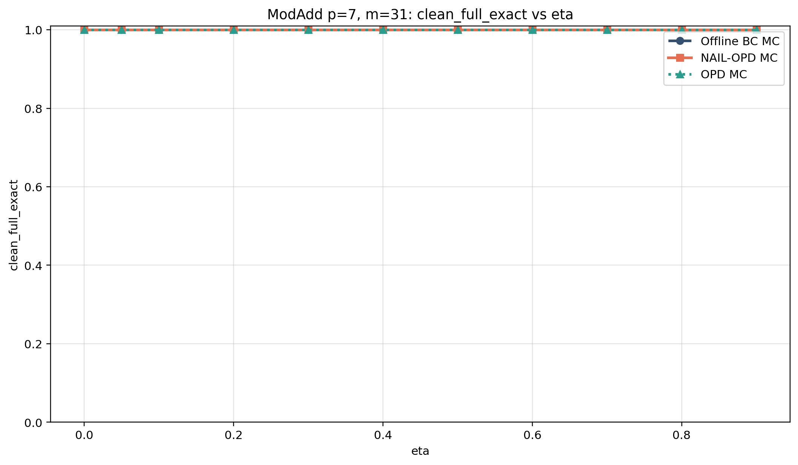

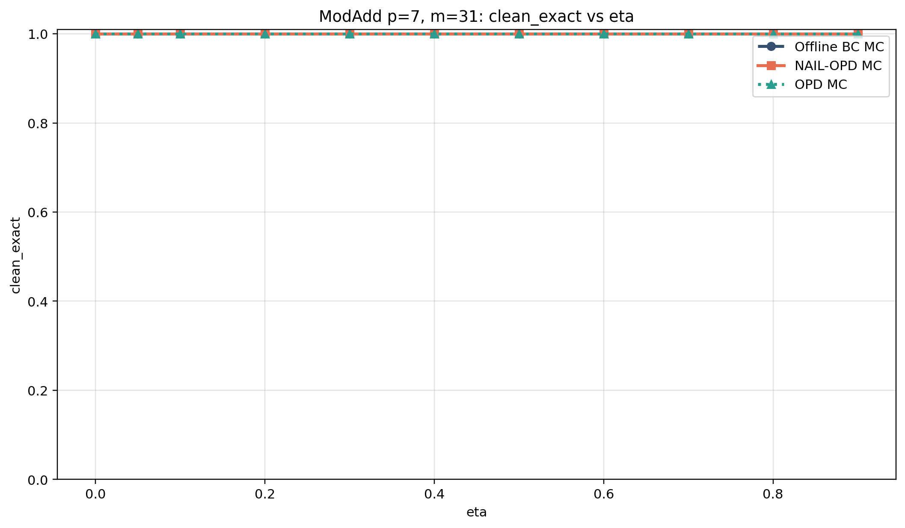

Per-eta `clean_full_exact` curves:

<code>clean_full_exact</code> per-eta figures

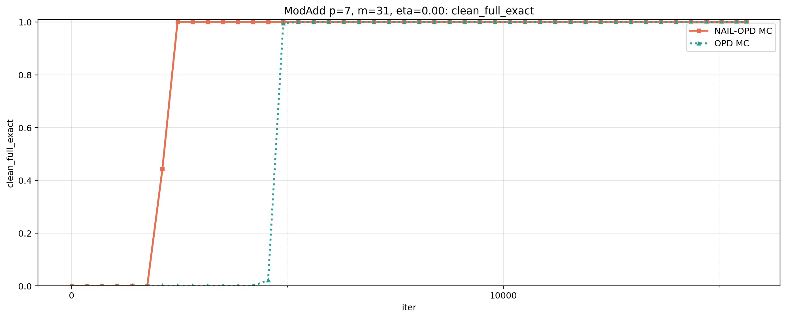

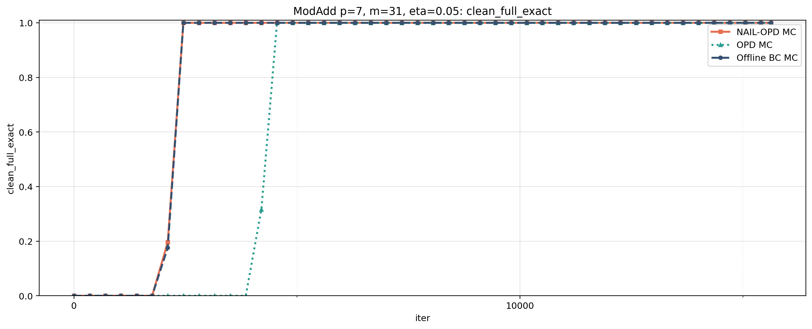

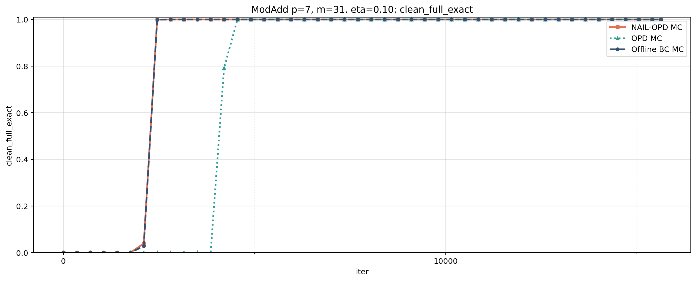

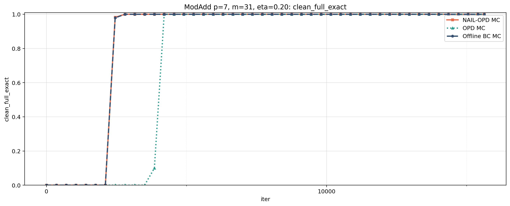

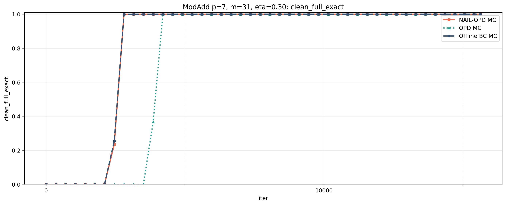

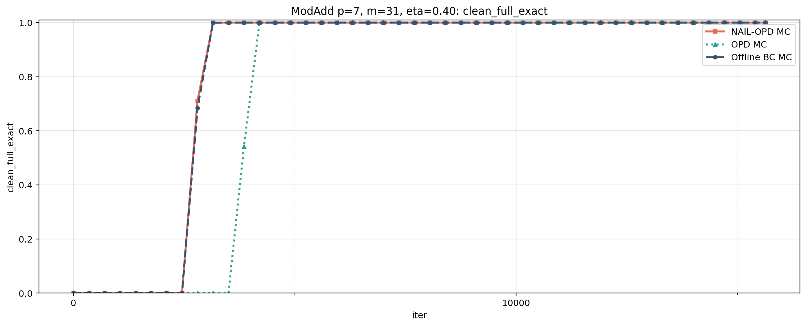

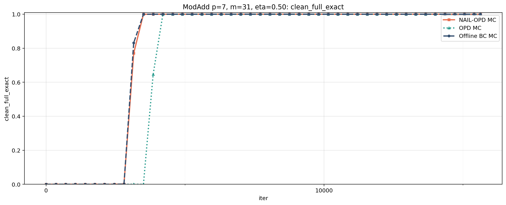

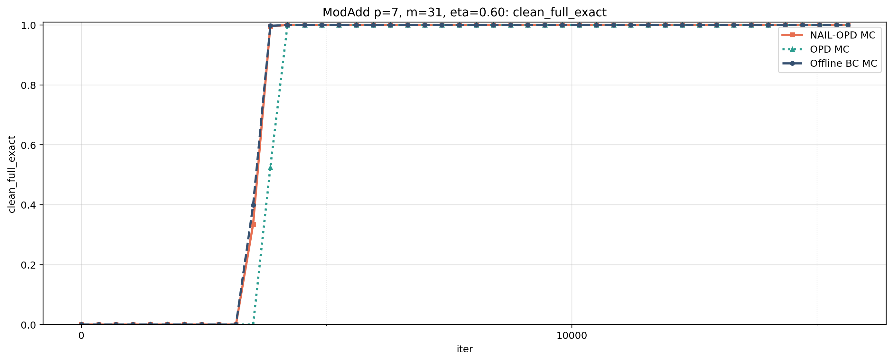

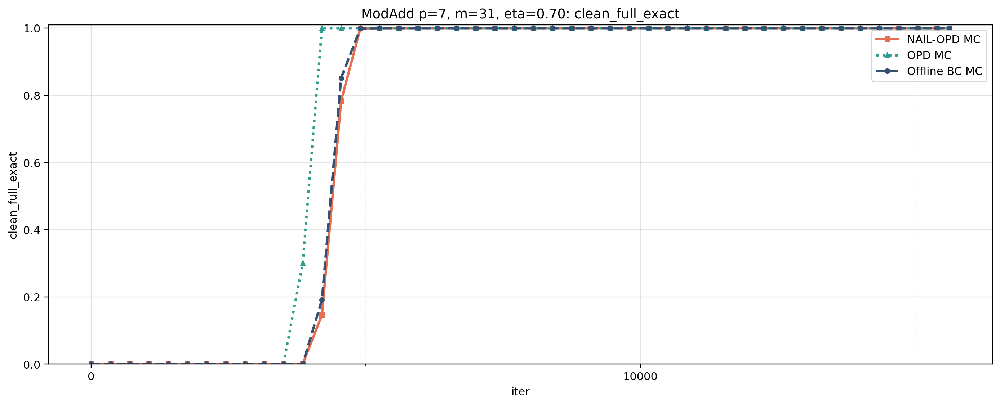

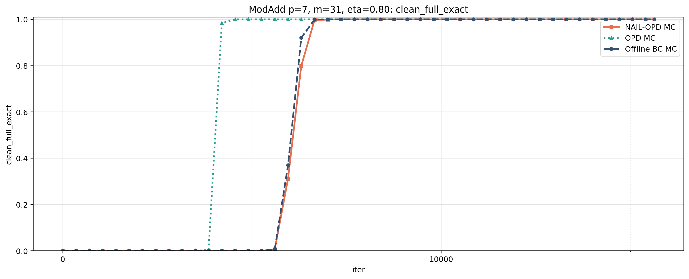

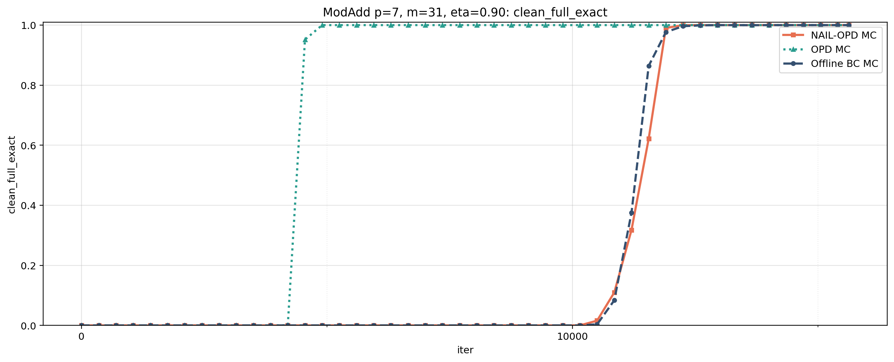

Per-eta `clean_final_exact` curves:

<code>clean_final_exact</code> per-eta figures

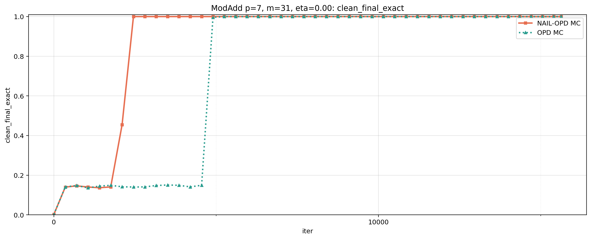

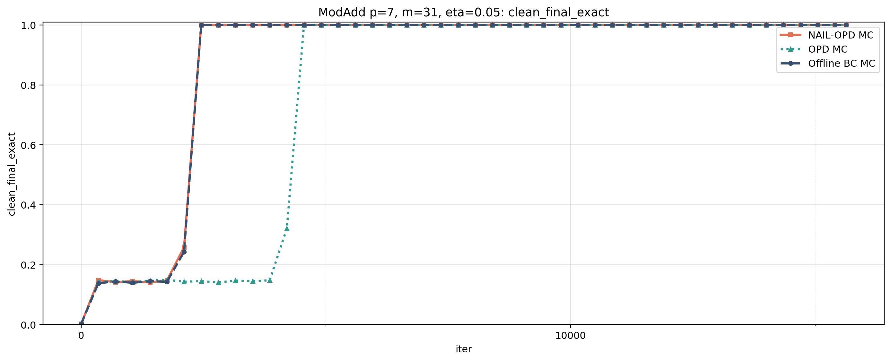

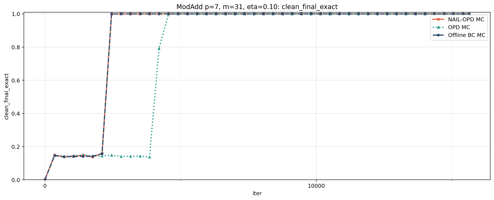

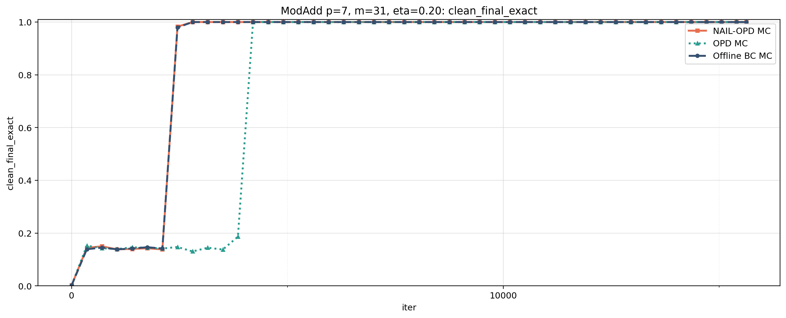

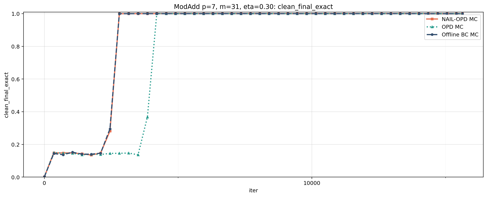

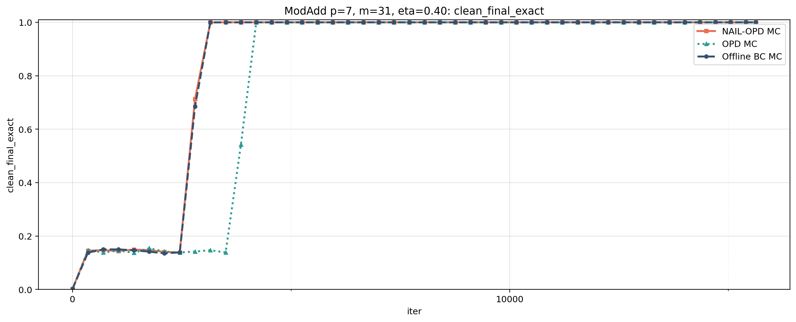

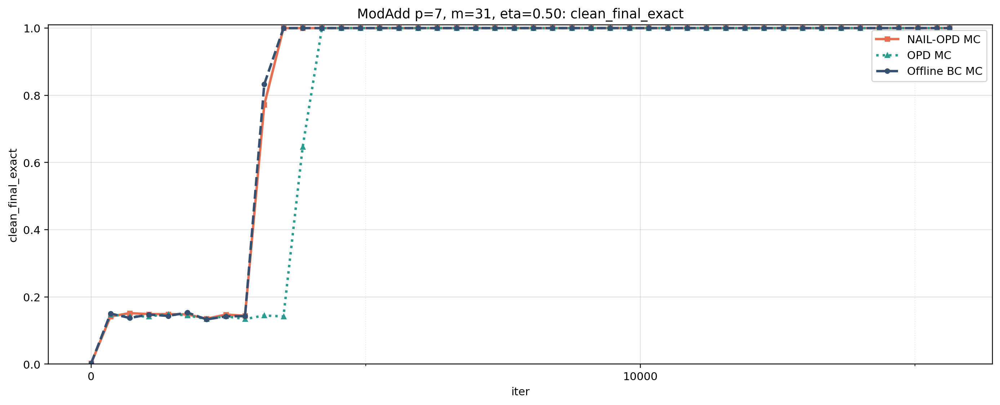

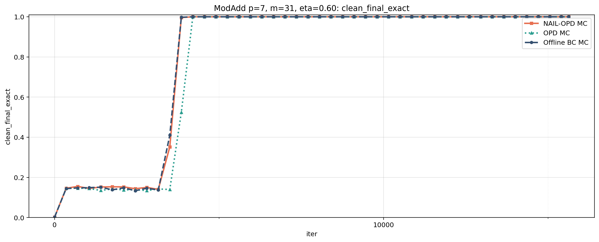

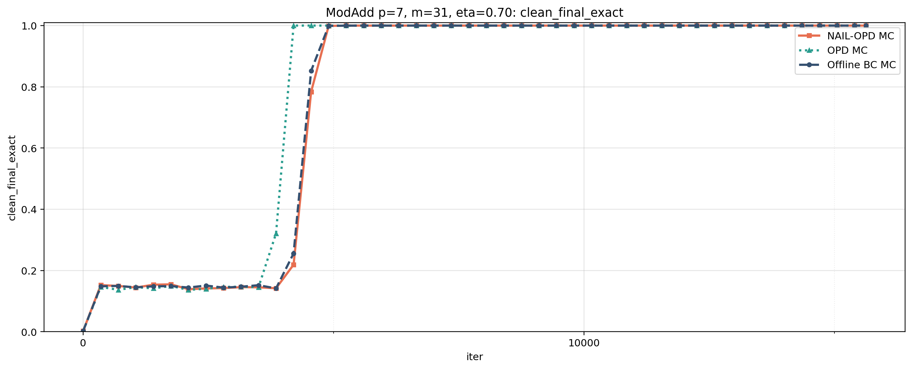

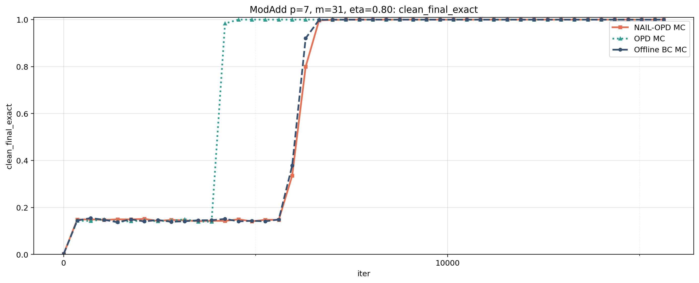

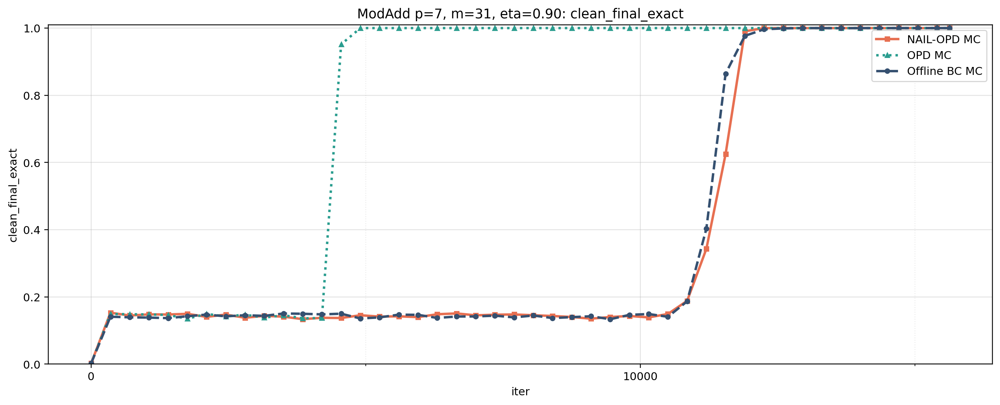

### 8.7 Modular-Addition TODO / Bookkeeping

- record the first canonical clean-expert run and its final metrics
- record the clean-offline threshold table and the chosen canonical subset size
- decide whether the clean-offline subset sweep should extend its default `SUBSET_SIZES` beyond `6000000` now that the base prompt-bank / clean-render defaults point at the `15M` family
- once real run dirs exist, populate per-eta tables for:
  - clean offline BC baseline
  - noisy offline BC, `greedy_then_corrupt`
  - noisy offline BC, `sample_then_corrupt`
  - OPD / NAIL-OPD family as implemented

<!-- | Comparison | Sweep | Matched law | Status | Notes |
|---|---|---|---|---|
| Clean baseline | Clean offline BC, `eta = 0.0`, chosen `n8000000-fixed` baseline | clean teacher | Done | Canonical off-policy clean baseline for all later comparisons |
| Off-policy MC baseline | Offline BC, `sample_then_corrupt`, full `eta` sweep | `sample_then_corrupt` | In Progress | earlier results are recorded; higher-`eta` runs are being rerun on the dev node because of a learning-rate issue in the earlier attempt |
| On-policy MC | NAIL-OPD (MC version), full `eta` sweep | `distributional_noise` | Done | Main on-policy MC family |
| On-policy MC | OPD (MC version), full `eta` sweep | `distributional_noise` | In Progress | This is the current OPD MC sweep that is running |
| Off-policy greedy-corrupt baseline | Offline BC, `greedy_then_corrupt`, full `eta` sweep | `greedy_then_corrupt` | In Progress | earlier results are recorded, but being rerun on the dev node because of the learning-rate mishap |
| On-policy full-distribution | NAIL-OPD (full KL distributional info), full `eta` sweep | `distributional_noise` | Done | Completed online full-distribution family |
| Off-policy full-distribution match | Offline BC trained on full teacher next-token distributions, full `eta` sweep | `distributional_noise` | Deferred | Implemented, but intentionally paused while the MC/simple comparison matrix is prioritized |
| On-policy full-distribution | OPD (full KL distributional info), full `eta` sweep | `distributional_noise` | Deferred | `reverse_kl_full` is implemented and resumable from AICS `ckpt.pt`, but the active cluster focus has shifted back to MC/simple methods |
| On-policy MC greedy-corrupt match | NAIL-OPD (MC version), full `eta` sweep | `corrupted_greedy` | TODO | Direct online match to completed offline `greedy_then_corrupt` BC |
| On-policy MC greedy-corrupt match | OPD (MC version), full `eta` sweep | `corrupted_greedy` | TODO | Needed if the OPD MC family is to be matched to offline `greedy_then_corrupt` as well |
| On-policy full-distribution greedy-corrupt ablation | NAIL-OPD (full KL distributional info), full `eta` sweep | `corrupted_greedy` | TODO | Needed if teacher-law ablations are to be symmetric in the full-information setting |
| Off-policy full-distribution greedy-corrupt match | Offline BC trained on full teacher next-token distributions, full `eta` sweep | `corrupted_greedy` | TODO | Current implementation does not support this teacher-law family yet |
| On-policy full-distribution greedy-corrupt ablation | OPD (full KL distributional info), full `eta` sweep | `corrupted_greedy` | TODO | Full-information OPD teacher-law ablation | -->

<!-- - exact compile state and exact eval-batch settings for some historical partial / crashed OPD runs whose names do not encode them -->
<!-- - a fully matched on-policy vs off-policy comparison matrix is still missing:
  - online MC vs offline BC MC at matched `eta`
  - online full-distribution vs offline full-distribution at matched `eta`
  - OPD (MC version) vs OPD (full KL distributional info) at matched `eta` -->
