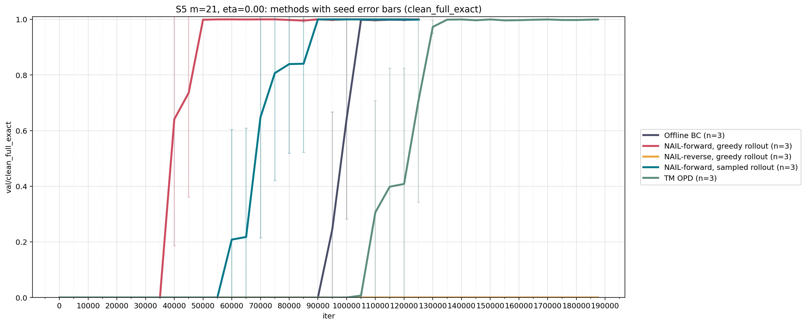
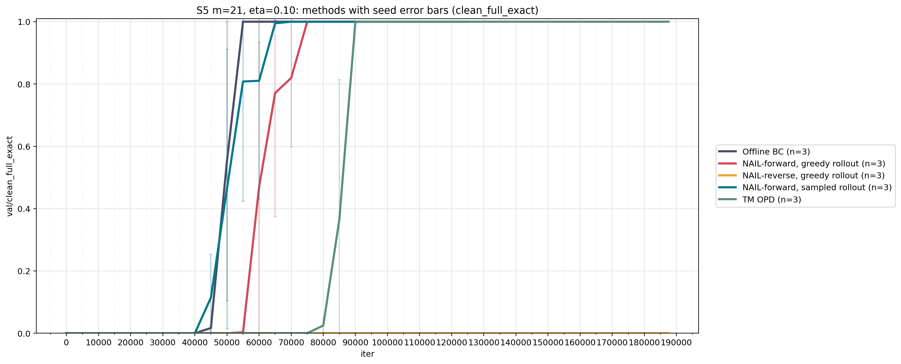
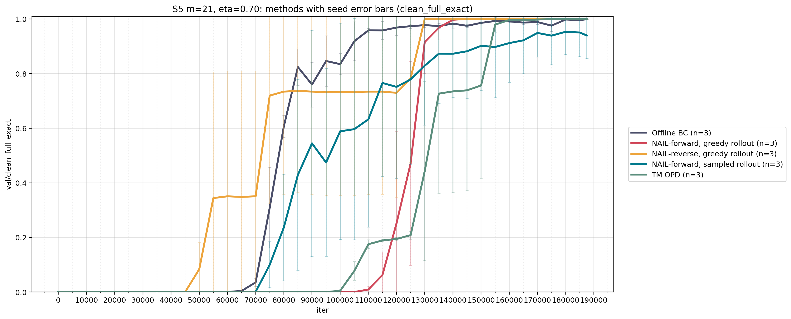
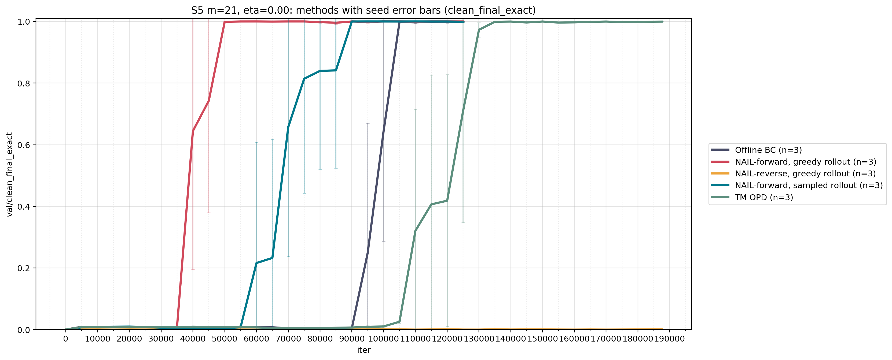
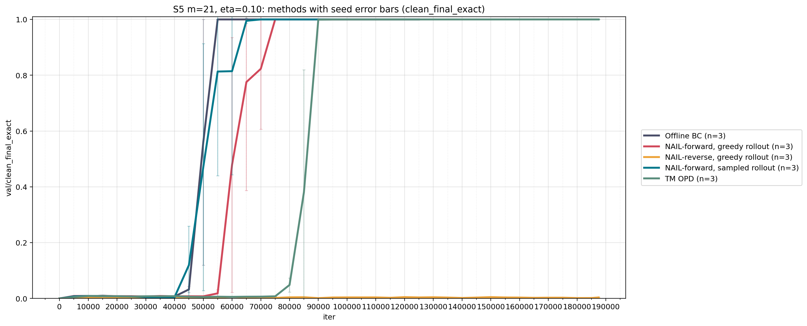
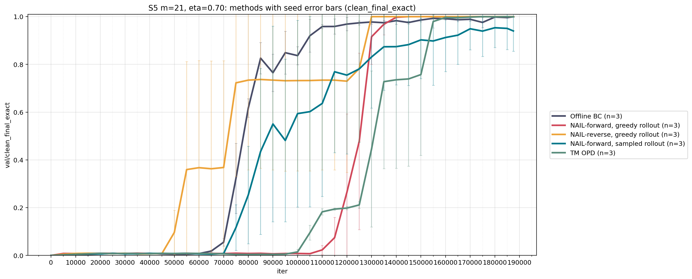

# New S5 Experiment Log

This log tracks the current S5, `m = 21` experiment suite under the native Hydra setup.

## Overview

For the S5, `m = 21` task, we first trained a clean expert with online CoT training for `100k` iterations.

- Experiment: `s5_cot_len21`
- Teacher seed: `20260417`
- Optim seed: `20260417`
- Intended training budget: `optim.max_iters=100000`, `optim.lr_decay_iters=100000`
- Output directory: `reruns/s5_m21_teacher20260417/out-s5-cot-m21-depth1-seed20260417`
- Fill in final metrics from `last_eval.json`: `[insert final val/loss, clean_full_exact, clean_final_exact]`
- Fill in any provenance notes: `[insert notes]`

<details>
<summary>Show clean expert hyperparameters and run details</summary>

- Hydra experiment: `s5_cot_len21`
- Pipeline: `pretrain`
- Task config family: `hydra_configs/task/s5_cot.yaml`
- Model config family: `hydra_configs/model/s5_len21_cot.yaml`
- Optim config family: `hydra_configs/optim/synthetic_expert.yaml`
- Runtime config family: `hydra_configs/runtime/gpu_float16.yaml`
- Cluster default: `local`
- Logging default: `enabled`
- Task:
  - `dataset = s5_cot`
  - `task = s5`
  - `s5_mode = cot`
  - `s5_m = 21`
  - `teacher_depth = 1`
  - `teacher_seed = 20260417`
- Model:
  - `n_layer = 1`
  - `n_head = 8`
  - `n_embd = 512`
  - `dropout = 0.0`
  - `bias = false`
  - `block_size = s5_block_size(task.s5_m, task.s5_mode)`
- Runtime:
  - `device = cuda`
  - `dtype = float16`
  - `backend = nccl`
  - `compile = true` at the experiment level
  - `torchrun.nproc_per_node = 1`
- Optimizer / training:
  - `init_from = scratch`
  - `batch_size = 64`
  - `gradient_accumulation_steps = 1`
  - `learning_rate = 1e-5`
  - `max_iters = 100000` for this run
  - `lr_decay_iters = 100000` for this run
  - `warmup_iters = 2000`
  - `decay_lr = true`
  - `min_lr = learning_rate`
  - `weight_decay = 0.0`
  - `beta1 = 0.9`
  - `beta2 = 0.95`
  - `grad_clip = 1.0`
  - `eval_interval = 5000`
  - `eval_iters = 200`
  - `log_interval = 50`
  - `always_save_checkpoint = true`
  - `save_every = 0`
  - `final_eval_on_exit = true`
  - `s5_eval_metrics = true`
  - `s5_eval_n = 5000` for this run
  - `s5_eval_batch_size = 512`
  - `s5_eval_seed = 123`
  - `optim.seed = 20260417`
- Output directory:
  - `reruns/s5_m21_teacher20260417/out-s5-cot-m21-depth1-seed20260417`
- Suggested provenance to record here:
  - exact launch command
  - host or machine used
  - wall-clock duration
  - final `last_eval.json`
  - whether the run converged before the full budget

</details>

We then use the fixed prompt bank
`data/s5_clean_prompt_bank_m21_n15000000_val5000`.

<details>
<summary>Show what the prompt bank stores</summary>

- `clean_train_prompt_ids.pt`
- `clean_train_cot_ids.pt`
- `clean_val_prompt_ids.pt`
- `clean_val_cot_ids.pt`
- `train_order.pt`
- `meta.json`

</details>

The consistency policy for the current S5 comparisons is:

- keep `bank_seed = 1337` fixed across all compared runs
- use the same prompt bank directory across methods
- use the same validation split copied from the prompt bank
- use fixed ordered prefix subsets of the same `train_order.pt`
- keep the prompt order unshuffled during training
- vary `teacher_seed`, `optim.seed`, and `render_seed` only when intentionally changing experiment seed families

This gives us fixed-order strict subsets of one common prompt bank. In particular:

- the `8M` subset is the prefix `train_order[:8000000]`
- the `12M` subset is the prefix `train_order[:12000000]`
- the `8M` subset is therefore a strict ordered subset of the `12M` subset

Verification notes for the prompt bank:

- `meta.seed = 1337`
- `n_train = 15000000`
- `n_val = 5000`
- `m = 21`
- `train_order.pt` is a full permutation of length `15000000`

## Seed Bookkeeping

- `bank_seed`: selects the prompt bank and therefore fixes training prompts, validation prompts, and `train_order`
- `teacher_seed`: selects which clean teacher checkpoint is used
- `render_seed`: selects rendered offline dataset identity for offline BC
- `optim.seed`: selects the training RNG for the current student or BC run

## Shared Hydra Backbone

<details>
<summary>Show shared Hydra backbone details</summary>

All native online methods in this log share the same default optimizer backbone from `hydra_configs/optim/opd.yaml` unless explicitly overridden:

- `batch_size = 64`
- `learning_rate = 1e-5`
- `warmup_iters = 2000`
- `decay_lr = true`
- `lr_decay_iters = max_iters`
- `min_lr = learning_rate`
- `weight_decay = 0.0`
- `beta1 = 0.9`
- `beta2 = 0.95`
- `grad_clip = 1.0`
- `eval_interval = 5000`
- `eval_n = 5000`
- `eval_batch_size = 512`
- `log_interval = 50`
- `single_epoch = true`
- `shuffle_prompts = false`

Shared model / runtime defaults for the current S5 work:

- runtime: `gpu_float16`
- architecture source for online methods: `teacher_inferred`
- effective teacher / student architecture for this family:
  - `n_layer = 1`
  - `n_head = 8`
  - `n_embd = 512`
  - `dropout = 0.0`
  - `bias = false`

</details>

<details>
<summary>Show offline BC caveats</summary>

Offline BC is close but not identical to the native online methods:

- it uses `experiment=s5_noisy_bc`
- it runs through the `pretrain` pipeline rather than the native student-prefix trainer
- it uses `hydra_configs/optim/synthetic_offline_bc.yaml`
- the main optimizer values match the online defaults above
- it uses `offline_single_epoch = true` rather than the online trainer's `single_epoch = true`
- it consumes rendered datasets from disk rather than reading the prompt bank directly during training
- it depends on `task.render_seed`
- offline rollout law and online `teacher_law` are different config surfaces and should not be conflated
- for the current matching rule, compare:
  - offline BC with `rollout_mode=sample_then_corrupt`
  - online NAIL / OPD with `teacher_law=distributional_noise`

</details>

<details>
<summary>Semantic key noise commands</summary>

The `semantic_key_noise` teacher law corrupts one S5 value coordinate per CoT block. It samples from the mixed law at key positions and rolls sampled key tokens into later teacher prefixes.

Render semantic-key noisy offline data:

```bash
python -m nanogpt.run experiment=s5_render \
  task.bank_seed=1337 \
  task.teacher_seed=20260417 \
  task.render_seed=20260417 \
  task.n_train=15000000 \
  task.n_val=5000 \
  task.subset_size=1000000 \
  task.prompt_bank_dir=data/s5_clean_prompt_bank_m21_n15000000_val5000 \
  task.teacher_law=semantic_key_noise \
  task.eta=0.5 \
  task.semantic_key_noise.coord_strategy=cyclic \
  task.gen_batch_size=8192
```

Audit rendered semantic-key data:

```bash
python scripts/audit_s5_offline_dataset_accuracy.py \
  task.bank_seed=1337 \
  task.teacher_seed=20260417 \
  task.render_seed=20260417 \
  task.n_train=15000000 \
  task.n_val=5000 \
  task.subset_size=1000000 \
  task.prompt_bank_dir=data/s5_clean_prompt_bank_m21_n15000000_val5000 \
  task.teacher_law=semantic_key_noise \
  task.eta=0.5
```

Train offline BC on the rendered data:

```bash
python -m nanogpt.run experiment=s5_noisy_bc \
  task.bank_seed=1337 \
  task.teacher_seed=20260417 \
  task.render_seed=20260417 \
  task.n_train=15000000 \
  task.n_val=5000 \
  task.subset_size=1000000 \
  task.prompt_bank_dir=data/s5_clean_prompt_bank_m21_n15000000_val5000 \
  task.teacher_law=semantic_key_noise \
  task.eta=0.5 \
  optim.seed=20260417
```

Run online NAIL / OPD against the same law:

```bash
python -m nanogpt.run experiment=s5_nail \
  task.bank_seed=1337 \
  task.teacher_seed=20260417 \
  task.render_seed=20260417 \
  task.n_train=15000000 \
  task.n_val=5000 \
  task.subset_size=1000000 \
  task.prompt_bank_dir=data/s5_clean_prompt_bank_m21_n15000000_val5000 \
  task.teacher_law=semantic_key_noise \
  task.loss=forward \
  task.teacher_signal=mc \
  task.eta=0.5 \
  optim.seed=20260417

python -m nanogpt.run experiment=s5_opd \
  task.bank_seed=1337 \
  task.teacher_seed=20260417 \
  task.render_seed=20260417 \
  task.n_train=15000000 \
  task.n_val=5000 \
  task.subset_size=1000000 \
  task.prompt_bank_dir=data/s5_clean_prompt_bank_m21_n15000000_val5000 \
  task.teacher_law=semantic_key_noise \
  task.loss=reverse \
  task.teacher_signal=mc \
  task.eta=0.5 \
  optim.seed=20260417
```

Nohup/concurrent launch form. Define `COMMON_TASK` inside each `bash -lc` body so the child shell does not silently lose the overrides:

```bash
mkdir -p nohup_logs

nohup bash -lc '
set -euo pipefail
COMMON_TASK="task.bank_seed=1337 task.teacher_seed=20260417 task.render_seed=20260417 task.n_train=15000000 task.n_val=5000 task.subset_size=1000000 task.prompt_bank_dir=data/s5_clean_prompt_bank_m21_n15000000_val5000 task.teacher_law=semantic_key_noise task.eta=0.5 task.semantic_key_noise.coord_strategy=cyclic"
TEACHER_CKPT="task.teacher_checkpoint=reruns/s5_m21_teacher20260417/out-s5-cot-m21-depth1-seed20260417"
python -m nanogpt.run experiment=s5_render $COMMON_TASK $TEACHER_CKPT task.gen_batch_size=8192
python scripts/audit_s5_offline_dataset_accuracy.py $COMMON_TASK
python -m nanogpt.run experiment=s5_noisy_bc $COMMON_TASK $TEACHER_CKPT optim.seed=20260417
' > nohup_logs/s5_semantic_eta0p5_render_audit_bc.log 2>&1 &

nohup bash -lc '
set -euo pipefail
COMMON_TASK="task.bank_seed=1337 task.teacher_seed=20260417 task.render_seed=20260417 task.n_train=15000000 task.n_val=5000 task.subset_size=1000000 task.prompt_bank_dir=data/s5_clean_prompt_bank_m21_n15000000_val5000 task.teacher_law=semantic_key_noise task.eta=0.5 task.semantic_key_noise.coord_strategy=cyclic"
TEACHER_CKPT="task.teacher_checkpoint=reruns/s5_m21_teacher20260417/out-s5-cot-m21-depth1-seed20260417"
python -m nanogpt.run experiment=s5_nail $COMMON_TASK $TEACHER_CKPT optim.seed=20260417 task.loss=forward task.teacher_signal=mc
' > nohup_logs/s5_semantic_eta0p5_nail_forward.log 2>&1 &

nohup bash -lc '
set -euo pipefail
COMMON_TASK="task.bank_seed=1337 task.teacher_seed=20260417 task.render_seed=20260417 task.n_train=15000000 task.n_val=5000 task.subset_size=1000000 task.prompt_bank_dir=data/s5_clean_prompt_bank_m21_n15000000_val5000 task.teacher_law=semantic_key_noise task.eta=0.5 task.semantic_key_noise.coord_strategy=cyclic"
TEACHER_CKPT="task.teacher_checkpoint=reruns/s5_m21_teacher20260417/out-s5-cot-m21-depth1-seed20260417"
python -m nanogpt.run experiment=s5_opd $COMMON_TASK $TEACHER_CKPT optim.seed=20260417 task.loss=reverse task.teacher_signal=mc
' > nohup_logs/s5_semantic_eta0p5_opd_reverse.log 2>&1 &
```

8M semantic-key-noise launch. This is the same seed family as above, but uses `task.subset_size=8000000` and separate `n8m` log files:

```bash
mkdir -p nohup_logs

nohup bash -lc '
set -euo pipefail
COMMON_TASK="task.bank_seed=1337 task.teacher_seed=20260417 task.render_seed=20260417 task.n_train=15000000 task.n_val=5000 task.subset_size=8000000 task.prompt_bank_dir=data/s5_clean_prompt_bank_m21_n15000000_val5000 task.teacher_law=semantic_key_noise task.eta=0.5 task.semantic_key_noise.coord_strategy=cyclic"
TEACHER_CKPT="task.teacher_checkpoint=reruns/s5_m21_teacher20260417/out-s5-cot-m21-depth1-seed20260417"
python -m nanogpt.run experiment=s5_render $COMMON_TASK $TEACHER_CKPT task.gen_batch_size=8192
python scripts/audit_s5_offline_dataset_accuracy.py $COMMON_TASK
python -m nanogpt.run experiment=s5_noisy_bc $COMMON_TASK $TEACHER_CKPT optim.seed=20260417
' > nohup_logs/s5_semantic_eta0p5_n8m_render_audit_bc.log 2>&1 &
echo "n8m render/audit/bc pid: $!"

nohup bash -lc '
set -euo pipefail
COMMON_TASK="task.bank_seed=1337 task.teacher_seed=20260417 task.render_seed=20260417 task.n_train=15000000 task.n_val=5000 task.subset_size=8000000 task.prompt_bank_dir=data/s5_clean_prompt_bank_m21_n15000000_val5000 task.teacher_law=semantic_key_noise task.eta=0.5 task.semantic_key_noise.coord_strategy=cyclic"
TEACHER_CKPT="task.teacher_checkpoint=reruns/s5_m21_teacher20260417/out-s5-cot-m21-depth1-seed20260417"
python -m nanogpt.run experiment=s5_nail $COMMON_TASK $TEACHER_CKPT optim.seed=20260417 task.loss=forward task.teacher_signal=mc
' > nohup_logs/s5_semantic_eta0p5_n8m_nail_forward.log 2>&1 &
echo "n8m nail pid: $!"

nohup bash -lc '
set -euo pipefail
COMMON_TASK="task.bank_seed=1337 task.teacher_seed=20260417 task.render_seed=20260417 task.n_train=15000000 task.n_val=5000 task.subset_size=8000000 task.prompt_bank_dir=data/s5_clean_prompt_bank_m21_n15000000_val5000 task.teacher_law=semantic_key_noise task.eta=0.5 task.semantic_key_noise.coord_strategy=cyclic"
TEACHER_CKPT="task.teacher_checkpoint=reruns/s5_m21_teacher20260417/out-s5-cot-m21-depth1-seed20260417"
python -m nanogpt.run experiment=s5_opd $COMMON_TASK $TEACHER_CKPT optim.seed=20260417 task.loss=reverse task.teacher_signal=mc
' > nohup_logs/s5_semantic_eta0p5_n8m_opd_reverse.log 2>&1 &
echo "n8m opd pid: $!"
```

</details>

<details>
<summary>Random-suffix-after-error commands</summary>

The `random_suffix_after_error` teacher law is the absorbing poisoned-suffix law. It uses the mixed clean/random law at one key S5 value coordinate per CoT block. If the sampled key token differs from the clean teacher argmax, the rest of that rendered trajectory enters poisoned mode: later S5 value slots are random valid S5 values, while scaffold tokens remain valid parentheses.

For this implementation, the poisoning and random-suffix sampling RNG is `task.random_suffix_noise.seed`. In the S5 render config this defaults to `${task.render_seed}`. The commands below set both `task.render_seed=20260417` and `task.random_suffix_noise.seed=20260417` explicitly so the intent is visible in the launch record.

Common 8M eta-0.1 task overrides:

```bash
COMMON_TASK="task.s5_m=21 task.bank_seed=1337 task.teacher_seed=20260417 task.render_seed=20260417 task.random_suffix_noise.seed=20260417 task.n_train=15000000 task.n_val=5000 task.subset_size=8000000 task.prompt_bank_dir=data/s5_clean_prompt_bank_m21_n15000000_val5000 task.teacher_checkpoint=reruns/s5_m21_teacher20260417/out-s5-cot-m21-depth1-seed20260417 task.teacher_law=random_suffix_after_error task.eta=0.1 task.target_mode=tokens task.random_suffix_noise.key_positions=semantic_key task.random_suffix_noise.random_suffix_mode=valid_tokens task.random_suffix_noise.keep_format_tokens=true task.random_suffix_noise.apply_to=s5 task.random_suffix_noise.coord_strategy=cyclic"
```

Render S5 noisy offline data:

```bash
python -m nanogpt.run experiment=s5_noisy_render \
  $COMMON_TASK \
  task.gen_batch_size=8192
```

Audit rendered S5 data:

```bash
python -m scripts.audit_s5_offline_dataset_accuracy \
  $COMMON_TASK
```

Train offline BC on the rendered data:

```bash
python -m nanogpt.run experiment=s5_noisy_bc \
  $COMMON_TASK \
  optim.seed=20260417
```

Nohup render/audit/BC chain:

```bash
mkdir -p nohup_logs

nohup bash -lc '
set -euo pipefail
COMMON_TASK="task.s5_m=21 task.bank_seed=1337 task.teacher_seed=20260417 task.render_seed=20260417 task.random_suffix_noise.seed=20260417 task.n_train=15000000 task.n_val=5000 task.subset_size=8000000 task.prompt_bank_dir=data/s5_clean_prompt_bank_m21_n15000000_val5000 task.teacher_checkpoint=reruns/s5_m21_teacher20260417/out-s5-cot-m21-depth1-seed20260417 task.teacher_law=random_suffix_after_error task.eta=0.1 task.target_mode=tokens task.random_suffix_noise.key_positions=semantic_key task.random_suffix_noise.random_suffix_mode=valid_tokens task.random_suffix_noise.keep_format_tokens=true task.random_suffix_noise.apply_to=s5 task.random_suffix_noise.coord_strategy=cyclic"
python -m nanogpt.run experiment=s5_noisy_render $COMMON_TASK task.gen_batch_size=8192
python -m scripts.audit_s5_offline_dataset_accuracy $COMMON_TASK
python -m nanogpt.run experiment=s5_noisy_bc $COMMON_TASK optim.seed=20260417
' > nohup_logs/s5_random_suffix_eta0p1_n8m_render_audit_bc.log 2>&1 &
echo "random-suffix eta0p1 n8m render/audit/bc pid: $!"
```

Online NAIL / OPD note:

- Do not launch `experiment=s5_nail` or `experiment=s5_opd` with `task.teacher_law=random_suffix_after_error` yet.
- The online teacher-query path intentionally raises `NotImplementedError` for this law because it does not yet carry explicit poisoned-prefix state.
- For now, compare this run as an offline-BC stress test against the existing online `distributional_noise` / `semantic_key_noise` baselines, rather than as a matched online law.

</details>

For all of the below sweeps, we use the same clean expert (we used online CoT training for `100k` iterations) with seed `20260417`. So when running sweeps for other seeds, we change `task.render_seed` (for offline rendering) and `optim.seed` (for training) while keeping `task.teacher_seed = 20260417` the same. 

## Sweep Matrix With Seed 20260417

| Sweep | Etas | Matched law | Status | Notes |
|---|---|---|---|---|
| Offline BC | `0.0, 0.1, 0.7` | `sample_then_corrupt` | ✅ ran (again) on dev node | Interleave render and train per eta; uses rendered offline datasets rather than the prompt bank directly |
| NAIL-forward, greedy student rollout | `0.0, 0.1, 0.7` | `distributional_noise` | ✅ on dev node | Native `nail` with `loss=forward`; greedy rollout is the default NAIL behavior; `nail_forward_m21_seed20260417_n8m_remaining_resume.out` for eta `0.1` due to broken run |
| NAIL-reverse, greedy student rollout | `0.0, 0.1, 0.7` | `distributional_noise` | ✅ on dev node | Native `nail` with `loss=reverse`; same MC reverse estimator as TM-OPD but on greedy student prefixes |
| NAIL-forward, sampled student rollout | `0.0, 0.1, 0.7` | `distributional_noise` | ✅ `0.0, 0.1, 0.7` ran on aics cluster | Same as forward NAIL except override rollout temperature to `1.0` |
| TM OPD | `0.0, 0.1, 0.7` | `distributional_noise` | ✅ on dev node | Native `opd`; reverse-KL on sampled student rollouts |

## Sweep Matrix With Seed 20260418

| Sweep | Etas | Matched law | Status | Notes |
|---|---|---|---|---|
| Offline BC | `0.0, 0.1, 0.7` | `sample_then_corrupt` | ✅ on dev node | N/A |
| NAIL-forward, greedy student rollout | `0.0, 0.1, 0.7` | `distributional_noise` | ✅ `0.0, 0.1, 0.7` ran on aics cluster | N/A |
| NAIL-reverse, greedy student rollout | `0.0, 0.1, 0.7` | `distributional_noise` | ✅ ran on aics cluster | ran all for 12M |
| NAIL-forward, sampled student rollout | `0.0, 0.1, 0.7` | `distributional_noise` | ✅ ran on aics cluster | N/A |
| TM OPD | `0.0, 0.1, 0.7` | `distributional_noise` | ✅ on dev node | ran all for 12M |

## Sweep Matrix With Seed 20260419

| Sweep | Etas | Matched law | Status | Notes |
|---|---|---|---|---|
| Offline BC | `0.0, 0.1, 0.7` | `sample_then_corrupt` | ✅ on dev node | N/A |
| NAIL-forward, greedy student rollout | `0.0, 0.1, 0.7` | `distributional_noise` | ✅ on aics cluster | N/A |
| NAIL-reverse, greedy student rollout | `0.0, 0.1, 0.7` | `distributional_noise` | ✅ on aics cluster | ran all for 12M |
| NAIL-forward, sampled student rollout | `0.0, 0.1, 0.7` | `distributional_noise` | ✅ on aics cluster | N/A |
| TM OPD | `0.0, 0.1, 0.7` | `distributional_noise` | ✅ on dev node | ran all for 12M |

<details>
<summary>S5 m=21 Seed-Sweep Plots</summary>

Clean full exact:







Clean final exact:







</details>

## Methods Glossary

- All methods share:
  - task family: `s5`
  - sequence setting: `m = 21`
  - prompt bank: `data/s5_clean_prompt_bank_m21_n15000000_val5000`
  - fixed prompt-bank seed: `1337`
  - fixed validation split from the prompt bank
  - strict prefix subsets from the same `train_order.pt`
  - shared depth-1 architecture family
  - shared optimizer defaults unless explicitly overridden

<details>
<summary>Offline BC</summary>

Definition:

- Train on noisy offline trajectories rendered once from the teacher.

Hydra surface:

- Experiment: `s5_noisy_bc`
- Task config family: `hydra_configs/task/s5_noisy_offline.yaml`
- Optim config family: `hydra_configs/optim/synthetic_offline_bc.yaml`
- Pipeline: `pretrain`

Current matching choice:

- use `task.rollout_mode=sample_then_corrupt`
- use `task.target_mode=tokens`
- match online `teacher_law=distributional_noise`

Important notes:

- consumes rendered datasets from disk
- depends on `task.render_seed`
- should be compared against online runs with `teacher_law=distributional_noise`

Commands for seed `20260417`:

```bash
nohup bash -lc '
for eta in 0.0 0.1; do
  .venv/bin/python -m nanogpt.run \
    experiment=s5_render \
    task.s5_m=21 \
    task.bank_seed=1337 \
    task.teacher_seed=20260417 \
    task.render_seed=20260417 \
    task.n_train=15000000 \
    task.n_val=5000 \
    task.prompt_bank_dir=data/s5_clean_prompt_bank_m21_n15000000_val5000 \
    task.teacher_checkpoint=reruns/s5_m21_teacher20260417/out-s5-cot-m21-depth1-seed20260417 \
    task.subset_size=8000000 \
    task.rollout_mode=sample_then_corrupt \
    task.target_mode=tokens \
    task.eta=$eta || exit 1

  .venv/bin/python -m nanogpt.run \
    experiment=s5_noisy_bc \
    task.s5_m=21 \
    task.teacher_seed=20260417 \
    task.render_seed=20260417 \
    optim.seed=20260417 \
    task.subset_size=8000000 \
    task.rollout_mode=sample_then_corrupt \
    task.target_mode=tokens \
    task.eta=$eta || exit 1
done
' > logs/s5_bc_interleaved_m21_seed20260417_n8m_eta0p0_0p1.out 2>&1 &

nohup bash -lc '
eta=0.7

.venv/bin/python -m nanogpt.run \
  experiment=s5_render \
  task.s5_m=21 \
  task.bank_seed=1337 \
  task.teacher_seed=20260417 \
  task.render_seed=20260417 \
  task.n_train=15000000 \
  task.n_val=5000 \
  task.prompt_bank_dir=data/s5_clean_prompt_bank_m21_n15000000_val5000 \
  task.teacher_checkpoint=reruns/s5_m21_teacher20260417/out-s5-cot-m21-depth1-seed20260417 \
  task.subset_size=12000000 \
  task.rollout_mode=sample_then_corrupt \
  task.target_mode=tokens \
  task.eta=$eta || exit 1

.venv/bin/python -m nanogpt.run \
  experiment=s5_noisy_bc \
  task.s5_m=21 \
  task.teacher_seed=20260417 \
  task.render_seed=20260417 \
  optim.seed=20260417 \
  task.subset_size=12000000 \
  task.rollout_mode=sample_then_corrupt \
  task.target_mode=tokens \
  task.eta=$eta || exit 1
' > logs/s5_bc_interleaved_m21_seed20260417_n12m_eta0p7.out 2>&1 &
```

Results:

- `[paste run names, metrics, or notes here]`

</details>

<details>
<summary>NAIL-forward, greedy student rollout</summary>

Definition:

- Greedy student rollout on student prefixes, then forward-KL / teacher-token CE on those prefixes.

Hydra surface:

- Experiment: `s5_nail`
- Task config family: `hydra_configs/task/s5_nail.yaml`
- Optim config family: `hydra_configs/optim/opd.yaml`
- Pipeline: `nail`

Key settings:

- `task.loss=forward`
- `task.teacher_signal=mc`
- rollout is greedy by default for NAIL
- equivalently, `task.rollout_temperature_override=0.0`

Commands for seed `20260417`:

```bash
nohup .venv/bin/python -m nanogpt.run --multirun \
  experiment=s5_nail \
  task.s5_m=21 \
  task.bank_seed=1337 \
  task.teacher_seed=20260417 \
  optim.seed=20260417 \
  task.n_train=15000000 \
  task.n_val=5000 \
  task.prompt_bank_dir=data/s5_clean_prompt_bank_m21_n15000000_val5000 \
  task.teacher_checkpoint=reruns/s5_m21_teacher20260417/out-s5-cot-m21-depth1-seed20260417 \
  task.teacher_signal=mc \
  task.loss=forward \
  task.rollout_temperature_override=0.0 \
  task.subset_size=8000000 \
  task.eta=0.0,0.1 \
  > logs/nail_forward_m21_seed20260417_n8m.out 2>&1 &
```

Example of resume usage below

```bash
nohup .venv/bin/python -m nanogpt.run --multirun \
  experiment=s5_nail \
  optim.init_from=resume \
  task.s5_m=21 \
  task.bank_seed=1337 \
  task.teacher_seed=20260417 \
  optim.seed=20260417 \
  task.n_train=15000000 \
  task.n_val=5000 \
  task.prompt_bank_dir=data/s5_clean_prompt_bank_m21_n15000000_val5000 \
  task.teacher_checkpoint=reruns/s5_m21_teacher20260417/out-s5-cot-m21-depth1-seed20260417 \
  task.teacher_signal=mc \
  task.loss=forward \
  task.rollout_temperature_override=0.0 \
  task.subset_size=8000000 \
  task.eta=0.1 \
  > logs/nail_forward_m21_seed20260417_n8m_remaining_resume.out 2>&1 &

nohup .venv/bin/python -m nanogpt.run \
  experiment=s5_nail \
  task.s5_m=21 \
  task.bank_seed=1337 \
  task.teacher_seed=20260417 \
  optim.seed=20260417 \
  task.n_train=15000000 \
  task.n_val=5000 \
  task.prompt_bank_dir=data/s5_clean_prompt_bank_m21_n15000000_val5000 \
  task.teacher_checkpoint=reruns/s5_m21_teacher20260417/out-s5-cot-m21-depth1-seed20260417 \
  task.teacher_signal=mc \
  task.loss=forward \
  task.rollout_temperature_override=0.0 \
  task.subset_size=12000000 \
  task.eta=0.7 \
  > logs/nail_forward_m21_seed20260417_n12m.out 2>&1 &
```

Results:

- `[paste run names, metrics, or notes here]`

</details>

<details>
<summary>NAIL-reverse, greedy student rollout</summary>

Definition:

- Greedy student rollout on student prefixes, then reverse-KL on those same prefixes.

Hydra surface:

- Experiment: `s5_nail`
- Task config family: `hydra_configs/task/s5_nail.yaml`
- Optim config family: `hydra_configs/optim/opd.yaml`
- Pipeline: `nail`

Key settings:

- `task.loss=reverse`
- `task.teacher_signal=mc`
- `task.rollout_temperature_override=0.0`

Important note:

- in the current MC setup, this uses the same sampled reverse-KL estimator as TM-OPD, but with greedy student rollouts instead of sampled student rollouts

Commands for seed `20260417`:

```bash
nohup .venv/bin/python -m nanogpt.run --multirun \
  experiment=s5_nail \
  task.s5_m=21 \
  task.bank_seed=1337 \
  task.teacher_seed=20260417 \
  optim.seed=20260417 \
  task.n_train=15000000 \
  task.n_val=5000 \
  task.prompt_bank_dir=data/s5_clean_prompt_bank_m21_n15000000_val5000 \
  task.teacher_checkpoint=reruns/s5_m21_teacher20260417/out-s5-cot-m21-depth1-seed20260417 \
  task.teacher_signal=mc \
  task.loss=reverse \
  task.rollout_temperature_override=0.0 \
  task.subset_size=8000000 \
  task.eta=0.0,0.1 \
  > logs/nail_reverse_m21_seed20260417_n8m.out 2>&1 &

nohup .venv/bin/python -m nanogpt.run \
  experiment=s5_nail \
  task.s5_m=21 \
  task.bank_seed=1337 \
  task.teacher_seed=20260417 \
  optim.seed=20260417 \
  task.n_train=15000000 \
  task.n_val=5000 \
  task.prompt_bank_dir=data/s5_clean_prompt_bank_m21_n15000000_val5000 \
  task.teacher_checkpoint=reruns/s5_m21_teacher20260417/out-s5-cot-m21-depth1-seed20260417 \
  task.teacher_signal=mc \
  task.loss=reverse \
  task.rollout_temperature_override=0.0 \
  task.subset_size=12000000 \
  task.eta=0.7 \
  > logs/nail_reverse_m21_seed20260417_n12m.out 2>&1 &
```

Results:

- `[paste run names, metrics, or notes here]`

</details>

<details>
<summary>NAIL-forward, sampled student rollout with temperature 1</summary>

Definition:

- Same forward NAIL loss as above, but with sampled student rollouts rather than greedy ones.

Hydra surface:

- Experiment: `s5_nail`
- Task config family: `hydra_configs/task/s5_nail.yaml`
- Optim config family: `hydra_configs/optim/opd.yaml`
- Pipeline: `nail`

Key settings:

- `task.loss=forward`
- `task.teacher_signal=mc`
- `task.rollout_temperature_override=1.0`

Commands for seed `20260417`:

```bash
nohup .venv/bin/python -m nanogpt.run --multirun \
  experiment=s5_nail \
  task.s5_m=21 \
  task.bank_seed=1337 \
  task.teacher_seed=20260417 \
  optim.seed=20260417 \
  task.n_train=15000000 \
  task.n_val=5000 \
  task.prompt_bank_dir=data/s5_clean_prompt_bank_m21_n15000000_val5000 \
  task.teacher_checkpoint=reruns/s5_m21_teacher20260417/out-s5-cot-m21-depth1-seed20260417 \
  task.teacher_signal=mc \
  task.loss=forward \
  task.rollout_temperature_override=1.0 \
  task.subset_size=8000000 \
  task.eta=0.0,0.1 \
  > logs/nail_forward_sampled_m21_seed20260417_n8m_eta0p0_0p1.out 2>&1 &

nohup .venv/bin/python -m nanogpt.run \
  experiment=s5_nail \
  task.s5_m=21 \
  task.bank_seed=1337 \
  task.teacher_seed=20260417 \
  optim.seed=20260417 \
  task.n_train=15000000 \
  task.n_val=5000 \
  task.prompt_bank_dir=data/s5_clean_prompt_bank_m21_n15000000_val5000 \
  task.teacher_checkpoint=reruns/s5_m21_teacher20260417/out-s5-cot-m21-depth1-seed20260417 \
  task.teacher_signal=mc \
  task.loss=forward \
  task.rollout_temperature_override=1.0 \
  task.subset_size=12000000 \
  task.eta=0.7 \
  > logs/nail_forward_sampled_m21_seed20260417_n12m_eta0p7.out 2>&1 &
```

Results:

- `[paste run names, metrics, or notes here]`

</details>

<details>
<summary>TM OPD</summary>

Definition:

- Sampled student rollout plus reverse-KL on sampled student prefixes.

Hydra surface:

- Experiment: `s5_opd`
- Task config family: `hydra_configs/task/s5_opd.yaml`
- Optim config family: `hydra_configs/optim/opd.yaml`
- Pipeline: `opd`

Key settings:

- `task.loss=reverse`
- `task.teacher_signal=mc`
- sampled student rollout is the OPD default
- equivalently, `task.rollout_temperature_override=1.0`

Commands for seed `20260417`:

```bash
nohup .venv/bin/python -m nanogpt.run --multirun \
  experiment=s5_opd \
  task.s5_m=21 \
  task.bank_seed=1337 \
  task.teacher_seed=20260417 \
  optim.seed=20260417 \
  task.n_train=15000000 \
  task.n_val=5000 \
  task.prompt_bank_dir=data/s5_clean_prompt_bank_m21_n15000000_val5000 \
  task.teacher_checkpoint=reruns/s5_m21_teacher20260417/out-s5-cot-m21-depth1-seed20260417 \
  task.teacher_signal=mc \
  task.loss=reverse \
  task.rollout_temperature_override=1.0 \
  task.subset_size=8000000 \
  task.eta=0.0,0.1 \
  > logs/tm_opd_m21_seed20260417_n8m_eta0p0_0p1.out 2>&1 &

nohup .venv/bin/python -m nanogpt.run \
  experiment=s5_opd \
  task.s5_m=21 \
  task.bank_seed=1337 \
  task.teacher_seed=20260417 \
  optim.seed=20260417 \
  task.n_train=15000000 \
  task.n_val=5000 \
  task.prompt_bank_dir=data/s5_clean_prompt_bank_m21_n15000000_val5000 \
  task.teacher_checkpoint=reruns/s5_m21_teacher20260417/out-s5-cot-m21-depth1-seed20260417 \
  task.teacher_signal=mc \
  task.loss=reverse \
  task.rollout_temperature_override=1.0 \
  task.subset_size=12000000 \
  task.eta=0.7 \
  > logs/tm_opd_m21_seed20260417_n12m_eta0p7.out 2>&1 &
```

Results:

- `[paste run names, metrics, or notes here]`

</details>

## Terminology Glossary

<details>
<summary>Show terminology glossary</summary>

- `sample_then_corrupt`:
  offline rollout law; at each step, sample from the clean teacher distribution, then corrupt the sampled digit with probability `eta`, and feed that corrupted token into the next step
- `distributional_noise`:
  online teacher-law name for the full next-token distribution induced by `sample_then_corrupt`; this is the distribution-level counterpart of the same noisy process
- `greedy_then_corrupt`:
  offline rollout law; at each step, take the clean teacher argmax token, then corrupt that greedy digit with probability `eta`, and feed that corrupted token into the next step
- `corrupted_greedy`:
  online teacher-law name for the full next-token distribution induced by `greedy_then_corrupt`; this is the distribution-level counterpart of the greedy-corrupt process
- current matching rule:
  compare NAIL / OPD runs using `teacher_law=distributional_noise` against offline BC `sample_then_corrupt`, not against offline BC `greedy_then_corrupt`
- `teacher_signal=mc`:
  the trainer uses Monte Carlo teacher information on sampled actions / targets rather than the full teacher distribution loss
- `teacher_signal=full`:
  the trainer uses the full teacher next-token distribution in the loss
- `loss=forward`:
  forward-KL style training objective; in the MC case this becomes teacher-token cross-entropy on sampled teacher targets
- `loss=reverse`:
  reverse-KL style training objective; in the MC case this becomes the sampled reverse-KL estimator used by TM-OPD and NAIL-reverse
- `bank_seed`:
  identifies the prompt bank and therefore the fixed train prompts, validation prompts, and `train_order`
- `teacher_seed`:
  identifies the clean teacher checkpoint
- `render_seed`:
  identifies rendered offline dataset variants
- `optim.seed`:
  identifies the RNG seed for the current training run

</details>

## Open Notes

- Fill in the clean expert metrics from `reruns/s5_m21_teacher20260417/out-s5-cot-m21-depth1-seed20260417/last_eval.json`
- Fill in per-eta result summaries once runs complete
- Add explicit seed-X and seed-Y values when those sweeps are planned
